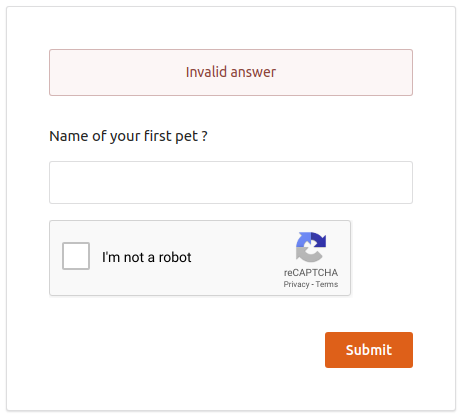

# Configuring Google reCaptcha for Security-Question Based Password Recovery

This topic guides you through configuring reCaptcha for secret questions
in the [password recovery
flow](../../learn/password-recovery#recovery-using-challenge-questions)
. By configuring reCaptcha, you can mitigate or block brute force
attacks.

!!! info 
        -   For more information on setting up password recovery with secret
        questions, see [Password
        Recovery](../../learn/password-recovery#recovery-using-challenge-questions).
        -   For more information on brute force attacks, see [Mitigating Brute
        Force Attacks](../../administer/mitigating-brute-force-attacks).

  

1.  Set up reCaptcha with the WSO2 Identity Server. For instructions on
    how to do this and more information about reCaptcha, see [Setting Up
    ReCaptcha](../../learn/setting-up-recaptcha).
2.  Start the WSO2 IS Server and login to the management console.
3.  Click **Resident** under **Identity Providers** found in the
    **Main** tab.
4.  Expand the **Account Management Policies** tab and then expand the
    **Account Recovery** tab.
5.  Select **Enable reCaptcha for Security Question Based Password
    Recovery** to enable reCaptcha for account recovery.  
     

6.  Enable account locking and Configure the **Max Failed Attempts for
    ReCaptcha**.

    !!! note
        This value should be less than the number of failed attempts configured in the account locking connector.
    
        
    

7.  You have now successfully configured reCaptcha for the password
    recovery with secret questions flow. The reCaptcha will be prompted
    if the user reaches the limit of max failed attempts when providing
    an answer to a secret question. For instance, since the **Max Failed
    Attempts for ReCaptcha** was configured as 2 above, if the user
    answers a question incorrectly twice, the reCaptcha will be prompted
    as seen in the window below.  
    
