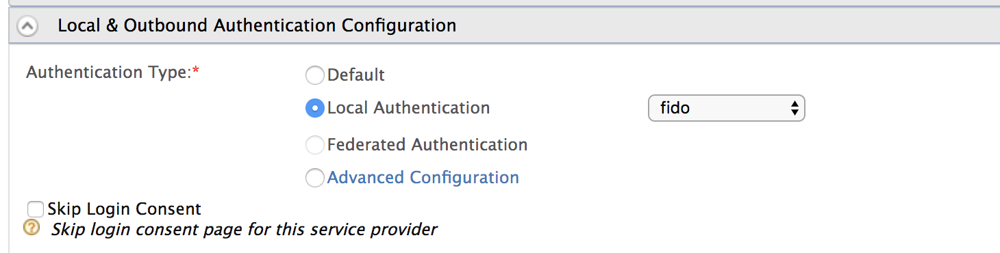

# Passwordless authentication using FIDO2

WSO2 Identity Server supports passwordless authentication using FIDO2, which is a phishing-proof 
passwordless authentication protocol developed as a joint effort between the FIDO Alliance and 
the World Wide Web Consortium (W3C). 


The three major enablers of the FIDO2 flow are;

1. The FIDO2 Authenticator (biometrics, mobile devices or FIDO2 security keys)
2. The client or browser that operates as a mediator
3. The WebAuthn Relying Party (WSO2 Identity Server)

<br>
    
??? info "Does your browser support your FIDO devices?"
    
    The <https://demo.yubico.com/webauthn-technical/registration> site can be used to check the browser
    support for FIDO devices.
    
!!! tip "Before you Begin"
    WSO2 Identity Server uses the WebAuthn API to enable FIDO-based passwordless authentication. 
    The WebAuthn API is supported from the following browser versions onwards:
    
    -   Chrome(CHROME 67) 
    -   Firefox (FIREFOX 60)
    -   Edge (EDGE 17723)

    Follow the steps given below to define the set of origin URLs where the WSO2 Identity Server User Portal will be hosted (e.g., `https://localhost:9443`):

    1. Open the `deployment.toml` file in the `<IS_HOME>/repository/conf` directory.
    2. Add the following configuration.
        ```toml
        [fido.trusted]
        origins=["https://localhost:9443"]
        ``` 
        

## Configuring passwordless authentication using FIDO2
 
### Setting up the FIDO2 device
To associate a FIDO2 device with the user account, refer [Add security device](../learn/user-portal.md#add-security-device).

### Configuring FIDO as an authenticator
1.  Sign in to the [Management Console](../../setup/getting-started-with-the-management-console). 
2.  To create a new Service Provider:
    1.  On the **Main** menu, click **Identity > Service Providers > Add**. 
    2.  Enter a name and a brief description of the service provider. 
    3.  Click **Register**. 

    !!! info 
        For more information on creating a service provider, see [Adding and Configuring a Service Provider](../../learn/adding-and-configuring-a-service-provider).


3.  In the **Local & Outbound Authentication Configuration** section, select **Local Authentication** and from the dropdown select **fido**. To enable passwordless authentication, the fido authenticator alone is sufficient.

    !!! info 
        For more information on configuring the local and outbound
        authentication configuration, see [Configuring Local and Outbound
        Authentication for a Service
        Provider](../../learn/configuring-local-and-outbound-authentication-for-a-service-provider)
        .

    


4.  Click **Update**.

## FIDO key progressive enrollment

Passkey progressive enrollment enables users to register their FIDO devices on-the-fly during authentication.

!!! note "Enable progressive enrollment"
    
    To enable this feature for your server, follow the steps below.

    !!! abstract ""    
    
        This feature is available for WSO2 IS 5.11.0 from update level 399 onwards (Updates 2.0 model). If you don't already have this update, see the instructions on [updating WSO2 products](https://updates.docs.wso2.com/en/latest/updates/overview/).
    
    1.  Shut down the server if it is running.
    2.  Add the following properties to the `deployment.toml` file in `<IS_HOME>/repository/conf` to enable the feature.

        ```toml 
        [fido]
        enable_passkey_progressive_enrollment = true
        ```
    3. Restart the server.

    4. Follow the guide below and configure your application for passkey progressive enrollment.

!!! note "Multiple passkey progressive enrollment"
    
    When this feature is enabled, users can register multiple passkeys during progressive enrollment. If not, it retains the default behavior of allowing only a single passkey enrollment.

    !!! abstract ""    
    
        This feature is available for WSO2 IS 5.11.0 from update level 420 onwards (Updates 2.0 model). If you don't already have this update, see the instructions on [updating WSO2 products](https://updates.docs.wso2.com/en/latest/updates/overview/).
    
    To allow users to register multiple passkeys under the same account during FIDO key progressive enrollment:

    Add the following configuration under `[fido]` in `<IS_HOME>/repository/conf/deployment.toml`:

        ```toml
        [fido]
        allow_multiple_passkey_progressive_enrollment = true
        ```

### Configure passkey progressive enrollment

If you have set up **FIDO** as a login option for your application, do the following to enable users to register their FIDO devices during the log in process. Before proceeding, ensure you have enabled the server-wide configuration for passkey progressive enrollment.

1. On the Management Console, go to **Service Providers** and click **Edit** with the relevant service provider.

2. Go to **Local & Outbound Authentication Configuration** and select **Advanced Configurations**.

3. In the **Script Based Adaptive Authentication** section, under **Progressive Enrollment**, select **Security Device Progressive Enrollment**.

4. Click **Update** to save your changes.

!!! warning "Important"
    Adding this script modifies the first step of the authentication flow to contain only the **basic** and **fido** authentication methods.

### How it works

Shown below is the adaptive authentication script for FIDO progressive enrollment. Let's take a look at how it works.

```javascript
var onLoginRequest = function(context) {
    executeStep(1, {
        onFail: function(context) {
            var authenticatorStatus = context.request.params.scenario;

            // If it is a passkey progressive enrollment request trigger the following flow.
            if (authenticatorStatus != null && authenticatorStatus[0] == 'INIT_FIDO_ENROLL') {
                var filteredAuthenticationOptions = filterAuthenticators(context.tenantDomain, context.steps[1].options, 'fido');
                executeStep(1, {
                    stepOptions: {
                        markAsSubjectIdentifierStep: 'true',
                        markAsSubjectAttributeStep: 'true'
                    },
                    authenticationOptions: filteredAuthenticationOptions
                }, {
                    onSuccess: function(context) {
                        // If user got successfully authenticated 
                        executeStep(1, {
                            stepOptions: {
                                forceAuth: 'true'
                            },
                            authenticationOptions: [{
                                authenticator: 'fido'
                            }]
                        }, {});
                    },
                });
            }
        }
    });
};
```

1. If the user chooses **FIDO Key** and consents to passkey enrollment, an `onFail` event is triggered. The parameter `scenario` returns the value `INIT_FIDO_ENROLL`, uniquely identifying the passkey enrollment request.

2. The `filterAuthenticators()` method takes the configured list of authenticators in the first step and the authenticator to be excluded and returns the list of authenticators excluding the FIDO authenticator(`fido`).

3. The user is then prompted for the first step of the authentication flow with `authenticationOptions` set to the list of filtered authenticators from the above step.

4. After successful authentication with an alternative authenticator, the script re-triggers the fido authenticator. This allows users to seamlessly proceed with security device progressive enrollment.
