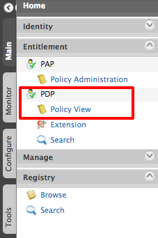
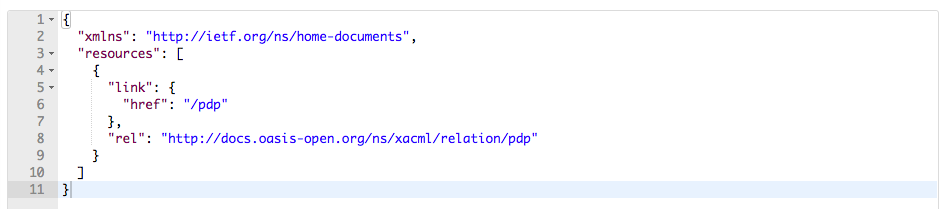

# Using REST APIs via XACML to Manage Entitlement

WSO2 Identity Server provides fine-grained, policy-based access control
via both XACML 2.0 and 3.0. REST APIs can be used with XACML 3.0 for
enriched entitlement management.

Some of the REST API features with XACML are as follows:

-   Allows RESTful access.
-   Allows processing of various kinds of requests: XACML and web
    requests by both XML and JSON and provides appropriate responses.
-   Handles the exceptions globally and provides necessary responses in
    a centralized manner.
-   Complies fully with the REST profile for XACML 3.0  
      

**In this tutorial, you learn** how Identity Server manages entitlements
with REST API via XACML.

!!! tip "Before you begin"
    Download and run the [WSO2 Identity
    Server](https://wso2.com/identity-and-access-management). For more
    details on running the Identity Server, see [Running the
    Product](../../setup/running-the-product).
    

Let's get started!

Once you have downloaded and started WSO2 Identity Server, you need to
deploy a XACML policy in Identity Server. This is done to learn how the
REST API works via XACML.

### Deploying the XACML policy in Identity Server

1.  Log in as an admin to access the [management
    console](../../setup/getting-started-with-the-management-console)
.
2.  Go to **Entitlement** dropdown menu in the **Main** tab. Click
    **Policy Administration** under PAP. You are directed to a page
    with sample policies.
3.  Click Add New Entitlement Policy.  
    
    
4.  Select **Import Existing Policy** from the available policy creation
    methods.
     
   
5.  In the Import New Entitlement Policy page, choose the policy file
    and click Upload.
    
    
    ??? note "Click to see a sample policy XML"	
		``` java
        <Policy xmlns="urn:oasis:names:tc:xacml:3.0:core:schema:wd-17" PolicyId="samplePolicy" RuleCombiningAlgId="urn:oasis:names:tc:xacml:3.0:rule-combining-algorithm:deny-overrides" Version="1.0">
            <Target>
                <AnyOf>
                    <AllOf>
                        <Match MatchId="urn:oasis:names:tc:xacml:1.0:function:string-equal">
                            <AttributeValue DataType="http://www.w3.org/2001/XMLSchema#string">read</AttributeValue>
                            <AttributeDesignator AttributeId="urn:oasis:names:tc:xacml:1.0:action:action-id" Category="urn:oasis:names:tc:xacml:3.0:attribute-category:action" DataType="http://www.w3.org/2001/XMLSchema#string" MustBePresent="true"/>
                        </Match>
                    </AllOf>
                </AnyOf>
            </Target>
            <Rule Effect="Permit" RuleId="permit"/>
        </Policy>
		```

6.  The uploaded policy is listed in Policy Administration page. Select
    the policy and click **Publish To My PDP** button.  
    
    
7.  In the Publish Policy page, click Publish.

8.  Click **Yes** to confirm publishing to PDP.  
    
    
9.  Click **Policy View** under PDP.  
    
    
    The **PDP Policy View** lists the published policy.  
    

### Test how REST API works via XACML

Now you can test how REST API works via XACML. To do this, you can use
any application that is used to test REST API calls. This tutorial uses
a Google Chrome plug-in called
[Postman](https://chrome.google.com/webstore/detail/postman/fhbjgbiflinjbdggehcddcbncdddomop?hl=en)
to accomplish this. First you need to install the Postman plugin.

##### To test the HTTP **GET method (API resource list)**

1.  Select the request type as **GET** , give the resource path as
    <https://localhost:9443/api/identity/entitlement/decision/home>. In
    the **Authorization** tab, for **Type** select 'Basic Auth',
    and provide admin/admin as user ID and password. Then click **Update
    Request**.  
    
    
2.  In the **Headers** tab, provide the values as below, and click
    **Send.**

	-   Authorization : Basic YWRtaW46YWRtaW4= (Base 64 encoded
		username:password)
	-   Content-Type : application/json or application/xml
	-   Accept : application/json or application/xml

	

	The JSON response you get is similar to the following:

	

	The XML response you get is similar to the following:

	

##### To evaluate the XACML request

1.  Select the request type as **POST** and provide the resource path as
    <https://localhost:9443/api/identity/entitlement/decision/pdp>.
2.  In the **Authorization** tab, for **Type**, select **Basic Auth**,
    and provide admin/admin as the **Username** and **Password**. Click
    **Update Request**.  
    
    
3.  In the **Headers** tab, provide the values as indicated below:

    -   Authorization : Basic YWRtaW46YWRtaW4= (Base 64 encoded
        username:password)
    -   Content-Type : application/json or application/xml
    -   Accept : application/json or application/xml
	
	
      
    In the body tab, copy and paste the following code and click
    **Send.**  

    **In JSON**

    ``` java
    {
        "Request": {
            "Action": {
                "Attribute": [
                    {
                        "AttributeId": "urn:oasis:names:tc:xacml:1.0:action:action-id",
                        "Value": "read"
                    }
                ]
            },
            "Resource": {
                "Attribute": [
                    {
                        "AttributeId": "urn:oasis:names:tc:xacml:1.0:resource:resource-id",
                        "Value": "http://127.0.0.1/service/very_secure/"
                    }
                ]
            }
        }
    }
    ```

    The JSON response you get is similar to the following:

      
    
    If you are using XML, copy the following XML code, paste it in the body, and click **Send**.

    ``` java
    <Request CombinedDecision="false" ReturnPolicyIdList="false" xmlns="urn:oasis:names:tc:xacml:3.0:core:schema:wd-17">
        <Attributes Category="urn:oasis:names:tc:xacml:3.0:attribute-category:action">
            <Attribute AttributeId="urn:oasis:names:tc:xacml:1.0:action:action-id" IncludeInResult="false">
                <AttributeValue DataType="http://www.w3.org/2001/XMLSchema#string">read</AttributeValue>
            </Attribute>
        </Attributes>
        <Attributes Category="urn:oasis:names:tc:xacml:3.0:attribute-category:resource">
            <Attribute AttributeId="urn:oasis:names:tc:xacml:1.0:resource:resource-id" IncludeInResult="false">
                <AttributeValue DataType="http://www.w3.org/2001/XMLSchema#string">http://127.0.0.1/service/very_secure/ </AttributeValue>
            </Attribute>
        </Attributes>
    </Request>
    ```

    The XML response is similar to the following:  
    

!!! note "For Tenant Users"
    The above resource path is only for Carbon super users. If the user is a
    tenant user the resource path should be:
    https://localhost:9443/t/{tenant\_domain}/api/identity/entitlement/decision/pdp.
    
    So if the tenant domain is [abc.com](http://abc.com) , the resource path
    should be:
    **https://localhost:9443/t/abc.com/api/identity/entitlement/decision/pdp**.
    
