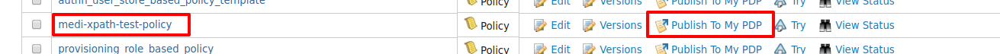

# Writing a XACML 3.0 Policy Using XPath

XPath is a major element in the XSLT standard and it is a syntax for
defining parts of an XML document. XPath can be used to navigate
through elements and attributes in an XML document.

XPath plays an important role in XACML when policies are evaluated for
XML-based data. When XML data is passed across nodes, PEP can be an
interception point that calls the PDP with parsing XML data. Based on
the XML data, PDP can take decisions.  Let's see how we can develop a
simple policy that can be used to evaluate XML data.

  
## Sample scenario

-   There is a healthcare application called "Medicom" where the online registered
    user (patient, doctor, etc.) can examine patients' data.
-   The patient datastore returns the data that is requested for the given
    patient id, regardless of the logged in user of the application.
-   Medicom has an authorization interceptor (PEP) between their web
    application and patient data store.  PEP would authorize the
    requested data by calling to a PDP.
-   The authorization rule here is that **users can only read their own patients' data**.


## Sample XACML policy

According to our usecase, it says “Users can only read their own patients'
data”. For example, if you log in to the Medicom web application with patient
id “alex” then you can only read the data that is stored for “alex”.

The code given below shows a sample policy that is written to match the
**resources** relevant to a specific **patientId.**

!!! note
	Here, the XPath evaluation is done with respect to the content element and it checks for a matching value. The content element has been bound to the  custom namespace and prefix eg: Path="//ak:record/ak:patient/ak:patientId/text()"
    
**Policy: XML**

``` java
<?xml version="1.0" encoding="UTF-8"?>
<Policy xmlns="urn:oasis:names:tc:xacml:3.0:core:schema:wd-17" PolicyId="medi-xpath-test-policy" RuleCombiningAlgId="urn:oasis:names:tc:xacml:1.0:rule-combining-algorithm:first-applicable" Version="1.0">
   <Description>XPath evaluation is done with respect to content elementand check for a matching value. Here content element has been bounded with custom namespace and prefix</Description>
   <PolicyDefaults>
      <XPathVersion>http://www.w3.org/TR/1999/REC-xpath-19991116</XPathVersion>
   </PolicyDefaults>
   <Target>
      <AnyOf>
         <AllOf>
            <Match MatchId="urn:oasis:names:tc:xacml:1.0:function:string-regexp-match">
               <AttributeValue DataType="http://www.w3.org/2001/XMLSchema#string">read</AttributeValue>
               <AttributeDesignator MustBePresent="false" Category="urn:oasis:names:tc:xacml:3.0:attribute-category:action" AttributeId="urn:oasis:names:tc:xacml:1.0:action:action-id" DataType="http://www.w3.org/2001/XMLSchema#string" />
            </Match>
         </AllOf>
      </AnyOf>
   </Target>
   <Rule RuleId="rule1" Effect="Permit">
      <Description>Rule to match value in content element using XPath</Description>
      <Condition>
         <Apply FunctionId="urn:oasis:names:tc:xacml:1.0:function:any-of">
            <Function FunctionId="urn:oasis:names:tc:xacml:1.0:function:string-equal" />
            <Apply FunctionId="urn:oasis:names:tc:xacml:1.0:function:string-one-and-only">
               <AttributeDesignator Category="urn:oasis:names:tc:xacml:1.0:subject-category:access-subject" AttributeId="urn:oasis:names:tc:xacml:1.0:subject:subject-id" DataType="http://www.w3.org/2001/XMLSchema#string" MustBePresent="false" />
            </Apply>
            <AttributeSelector MustBePresent="false" Category="urn:oasis:names:tc:xacml:3.0:attribute-category:resource" Path="//ak:record/ak:patient/ak:patientId/text()" DataType="http://www.w3.org/2001/XMLSchema#string" />
         </Apply>
      </Condition>
   </Rule>
   <Rule RuleId="rule2" Effect="Deny">
      <Description>Deny rule</Description>
   </Rule>
</Policy>
```

## Deploy and publish the policy

1.  Start WSO2 Identity Server and Log in to the management console.

2.  Go to **Policy Administration** under **PAP** in **Main** and click
    on **Add New Entitlement Policy.**

3.  Next click on **Import Existing Policy.**  
     

4.  Save the above sample policy to a file and import it as follows by
    clicking **upload**.  
    

5.  Once it is uploaded, you can see the added policy in the policy
    view. Publish it to PDP so that we can evaluate the policy with
    sample requests.
      

###    Evaluate the Policy

The easiest way to evaluate the poilcy is to use the **Try It** tool available in our
**Tools** menu in WSO2 Identity Server.

!!! note
    You can follow the steps given [here](../../administer/evaluating-a-xacml-policy) to try this using the Try It tool.

<table>
<colgroup>
<col style="width: 23%" />
<col style="width: 76%" />
</colgroup>
<tbody>
<tr class="odd">
<td>Sample Request</td>
<td><div class="content-wrapper">
<div class="code panel pdl" style="border-width: 1px;">
<div class="codeContent panelContent pdl">
<div class="sourceCode" id="cb1" data-syntaxhighlighter-params="brush: java; gutter: false; theme: Confluence" data-theme="Confluence" style="brush: java; gutter: false; theme: Confluence"><pre class="sourceCode java"><code class="sourceCode java"><a class="sourceLine" id="cb1-1" title="1">&lt;?xml version=<span class="st">&quot;1.0&quot;</span> encoding=<span class="st">&quot;UTF-8&quot;</span>?&gt;</a>
<a class="sourceLine" id="cb1-2" title="2">&lt;<span class="bu">Request</span> xmlns=<span class="st">&quot;urn:oasis:names:tc:xacml:3.0:core:schema:wd-17&quot;</span> ReturnPolicyIdList=<span class="st">&quot;false&quot;</span> CombinedDecision=<span class="st">&quot;false&quot;</span>&gt;</a>
<a class="sourceLine" id="cb1-3" title="3">   &lt;<span class="bu">Attributes</span> Category=<span class="st">&quot;urn:oasis:names:tc:xacml:1.0:subject-category:access-subject&quot;</span>&gt;</a>
<a class="sourceLine" id="cb1-4" title="4">      &lt;<span class="bu">Attribute</span> IncludeInResult=<span class="st">&quot;false&quot;</span> AttributeId=<span class="st">&quot;urn:oasis:names:tc:xacml:1.0:subject:subject-id&quot;</span>&gt;</a>
<a class="sourceLine" id="cb1-5" title="5">         &lt;AttributeValue DataType=<span class="st">&quot;http://www.w3.org/2001/XMLSchema#string&quot;</span>&gt;alex&lt;/AttributeValue&gt;</a>
<a class="sourceLine" id="cb1-6" title="6">      &lt;/<span class="bu">Attribute</span>&gt;</a>
<a class="sourceLine" id="cb1-7" title="7">   &lt;/<span class="bu">Attributes</span>&gt;</a>
<a class="sourceLine" id="cb1-8" title="8">   &lt;<span class="bu">Attributes</span> Category=<span class="st">&quot;urn:oasis:names:tc:xacml:3.0:attribute-category:resource&quot;</span>&gt;</a>
<a class="sourceLine" id="cb1-9" title="9">      &lt;Content&gt;</a>
<a class="sourceLine" id="cb1-10" title="10">         &lt;ak:record xmlns:ak=<span class="st">&quot;http://akpower.org&quot;</span>&gt;</a>
<a class="sourceLine" id="cb1-11" title="11">            &lt;ak:patient&gt;</a>
<a class="sourceLine" id="cb1-12" title="12">               &lt;ak:patientId&gt;alex&lt;/ak:patientId&gt;</a>
<a class="sourceLine" id="cb1-13" title="13">               &lt;ak:patientName&gt;</a>
<a class="sourceLine" id="cb1-14" title="14">                  &lt;ak:first&gt;alex&lt;/ak:first&gt;</a>
<a class="sourceLine" id="cb1-15" title="15">                  &lt;ak:last&gt;Allan&lt;/ak:last&gt;</a>
<a class="sourceLine" id="cb1-16" title="16">               &lt;/ak:patientName&gt;</a>
<a class="sourceLine" id="cb1-17" title="17">               &lt;ak:patientContact&gt;</a>
<a class="sourceLine" id="cb1-18" title="18">                  &lt;ak:street&gt;<span class="dv">51</span> Main road&lt;/ak:street&gt;</a>
<a class="sourceLine" id="cb1-19" title="19">                  &lt;ak:city&gt;Colombo&lt;/ak:city&gt;</a>
<a class="sourceLine" id="cb1-20" title="20">                  &lt;ak:state&gt;Western&lt;/ak:state&gt;</a>
<a class="sourceLine" id="cb1-21" title="21">                  &lt;ak:zip&gt;<span class="dv">11730</span>&lt;/ak:zip&gt;</a>
<a class="sourceLine" id="cb1-22" title="22">                  &lt;ak:phone&gt;<span class="dv">94332189873</span>&lt;/ak:phone&gt;</a>
<a class="sourceLine" id="cb1-23" title="23">                  &lt;ak:email&gt;alex<span class="at">@wso2</span>.<span class="fu">com</span>&lt;/ak:email&gt;</a>
<a class="sourceLine" id="cb1-24" title="24">               &lt;/ak:patientContact&gt;</a>
<a class="sourceLine" id="cb1-25" title="25">               &lt;ak:patientDoB&gt;<span class="dv">1991</span>-<span class="bn">05</span>-<span class="dv">11</span>&lt;/ak:patientDoB&gt;</a>
<a class="sourceLine" id="cb1-26" title="26">               &lt;ak:patientGender&gt;male&lt;/ak:patientGender&gt;</a>
<a class="sourceLine" id="cb1-27" title="27">            &lt;/ak:patient&gt;</a>
<a class="sourceLine" id="cb1-28" title="28">         &lt;/ak:record&gt;</a>
<a class="sourceLine" id="cb1-29" title="29">      &lt;/Content&gt;</a>
<a class="sourceLine" id="cb1-30" title="30">   &lt;/<span class="bu">Attributes</span>&gt;</a>
<a class="sourceLine" id="cb1-31" title="31">   &lt;<span class="bu">Attributes</span> Category=<span class="st">&quot;urn:oasis:names:tc:xacml:3.0:attribute-category:action&quot;</span>&gt;</a>
<a class="sourceLine" id="cb1-32" title="32">      &lt;<span class="bu">Attribute</span> IncludeInResult=<span class="st">&quot;false&quot;</span> AttributeId=<span class="st">&quot;urn:oasis:names:tc:xacml:1.0:action:action-id&quot;</span>&gt;</a>
<a class="sourceLine" id="cb1-33" title="33">         &lt;AttributeValue DataType=<span class="st">&quot;http://www.w3.org/2001/XMLSchema#string&quot;</span>&gt;read&lt;/AttributeValue&gt;</a>
<a class="sourceLine" id="cb1-34" title="34">      &lt;/<span class="bu">Attribute</span>&gt;</a>
<a class="sourceLine" id="cb1-35" title="35">   &lt;/<span class="bu">Attributes</span>&gt;</a>
<a class="sourceLine" id="cb1-36" title="36">&lt;/<span class="bu">Request</span>&gt;</a></code></pre></div>
</div>
</div>
</div></td>
</tr>
<tr class="even">
<td>Sample Response</td>
<td><div class="content-wrapper">
<div class="code panel pdl" style="border-width: 1px;">
<div class="codeContent panelContent pdl">
<div class="sourceCode" id="cb2" data-syntaxhighlighter-params="brush: java; gutter: false; theme: Confluence" data-theme="Confluence" style="brush: java; gutter: false; theme: Confluence"><pre class="sourceCode java"><code class="sourceCode java"><a class="sourceLine" id="cb2-1" title="1">&lt;?xml version=<span class="st">&quot;1.0&quot;</span> encoding=<span class="st">&quot;UTF-8&quot;</span>?&gt;</a>
<a class="sourceLine" id="cb2-2" title="2">&lt;<span class="bu">Response</span>&gt;</a>
<a class="sourceLine" id="cb2-3" title="3">   &lt;<span class="bu">Result</span>&gt;</a>
<a class="sourceLine" id="cb2-4" title="4">      &lt;Decision&gt;Permit&lt;/Decision&gt;</a>
<a class="sourceLine" id="cb2-5" title="5">      &lt;Status&gt;</a>
<a class="sourceLine" id="cb2-6" title="6">         &lt;StatusCode Value=<span class="st">&quot;urn:oasis:names:tc:xacml:1.0:status:ok&quot;</span> /&gt;</a>
<a class="sourceLine" id="cb2-7" title="7">      &lt;/Status&gt;</a>
<a class="sourceLine" id="cb2-8" title="8">   &lt;/<span class="bu">Result</span>&gt;</a>
<a class="sourceLine" id="cb2-9" title="9">&lt;/<span class="bu">Response</span>&gt;</a></code></pre></div>
</div>
</div>
</div></td>
</tr>
</tbody>
</table>

  

  
