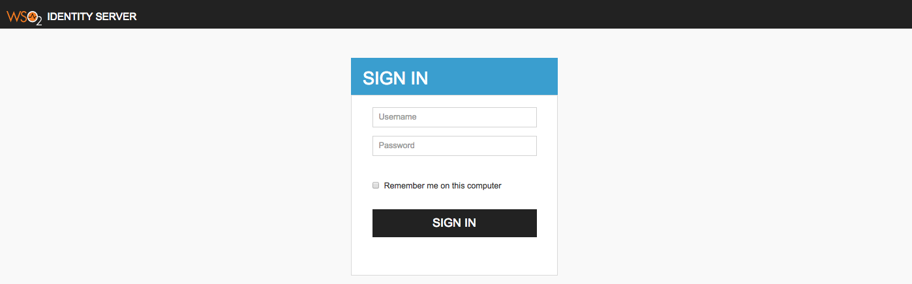

# Customizing Login Pages for Service Providers

Custom pages for logging into the server are available for SAML2 SSO,
OAuth and OpenID Connect. This section guides you through this
customization.

The login pages and other pages, such as error and notification screens,
of SAML SSO, OAuth, OpenID Connect, and Passive STS are located in the
**authenticationendpoint** webapp file, which is in the
`         <PRODUCT_HOME>/repository/deployment/server/webapps        `
directory.

You can easily customize these pages within this web application by
changing the respective JSPs, JavaScript and CSS. If you want to point
to a different web application, you can do so by redirecting or
forwarding from **authenticationendpoint** to your webapp. In the case
of SAML SSO, the ' **issuer** ' id of the service provider is also sent
to this webapp. Therefore, different login pages can be given to
different service providers by looking at the ' **issuer** ' request
parameter.

The following is a sample of how to customize the login page for SAML2
SSO.

## Customizing the login page for SAML SSO service providers

Usually WSO2 Identity Server displays a default login page for all the
SAML SSO service providers that send authentication requests to it. The
following steps indicate how to change the default login page into a
customized one.

### Configuring two service providers

1.  [Deploy traveloctity](../../learn/deploying-the-sample-app/#deploying-the-travelocity-webapp) sample application.

2.  Get a copy of `travelocity.com.war` that
    [download from here](../../learn/deploying-the-sample-app/#deploy-the-sample-web-application)
    to the same location `<TOMCAT_HOME>/webapps/` rename as
    `avis.com.war`. Restart the tomcat server.

    !!! note 
        -   Open ` <TOMCAT_HOME>/webapps/travelocity.com/
        travelocity.properties ` file and check for following
        configurations.
            ``` 
            #The URL of the SAML 2.0 Assertion Consumer
            SAML2.AssertionConsumerURL=http://wso2is.local:8080/travelocity.com/home.jsp
                
        
            #openid.return_to parameter
            OpenId.ReturnToURL=http://wso2is.local:8080/travelocity.com/home.jsp
            ```

        - Open the `<TOMCAT_HOME>/webapps/avis.com/avis.properties` file  and check for following configurations.
            ```
            #The URL of the SAML 2.0 Assertion Consumer
            SAML2.AssertionConsumerURL=http://wso2.is:8080/avis.com/home.jsp
        
            #openid.return_to parameter
            OpenId.ReturnToURL=http://wso2.is:8080/avis.com/home.jsp
            ```
3. Register a new service provider with name `avis.com` similarly as
   explained in [configuring service provider for travelocity
                                                sample](../../deploying-the-sample-app/#configuring-the-service-provider)
   while replacing `travelocity.com` references to `avis.com`.
   
4.  Start the application server and access following URLs to make sure
    both apps are running.

    **travelocity.com**

    URL:
    [http://wso2is.local:8080/travelocity.com/index.jsp](http://localhost:8080/travelocity.com/index.jsp)

     

    **avis.com**

    URL:
    [http://wso2is.local:8080/avis.com/index.jsp](http://localhost:8080/avis.com/index.jsp)

     

### Registering the two service providers in WSO2 Identity Server

1.  Sign in to the WSO2 Identity Server [Management
    Console](../../setup/getting-started-with-the-management-console).
2.  On the **Main** menu, click **Identity \> Service Providers \>**
    **Add**.
3.  Enter `          travelocity.com         ` as the **Service Provider
    Name** in the form that appears and click **Register**. The Service
    Providers page appears.  
     
4.  Under the **Inbound Authentication Configuration** section, click
    **SAML2 Web SSO Configuration \> Configure**. The Register New
    Service Provider page appears.  
     
5.  Configure the following details for travelocity.com and repeat steps
    1 to 6 and configure details for avis.com.

     

    **travelocity.com**

    -   ***Issuer*** : travelocity.com **
    -   ***Assertion Consumer URL*** :
        http://wso2is.local:8080/travelocity.com/home.jsp
    -   Select ***Enable Response Signing***
    -   Select ***Enable Single Logout***

    **avis.com**

    -   ***Issuer*** : avis.com **
    -   ***Assertion Consumer URL*** :
        http://wso2is.local:8080/avis.com/home.jsp
    -   Select ***Enable Response Signing***
    -   Select ***Enable Single Logout***

6.  When attempting to "login with SAML from WSO2 Identity Server" in
    Travelocity.com and Avis.com, you can see the following default
    page located at
    `          <IS_HOME>/repository/deployment/server/webapps/authenticationendpoint/login.jsp         `
    .  
     

### Configuring the login page

#### Understanding the authenticationendpoint web application

The login page that is displayed during SAML2 SSO, OAuth, OpenID Connect
and Passive-STS flows is located inside the webapp named
authenticationendpoint. The reason for storing this in a web app is:

-   to easily customize the page according to user requirements
-   if needed, place that whole web application in an external
    application server

The Identity Server knows the location of this web application as it is
specified with the following configurations.

```
[authentication.endpoints] 
login_url="/authenticationendpoint/login.do"
retry_url="/authenticationendpoint/retry.do" 
```

By default it points to a location inside the Identity Server itself,
thus the relative path is given. If it is necessary to point to an
external application, the full path should be given instead.

!!! note
    
    If this web app is moved outside the Identity Server, we must ensure
    that no one can access the login credentials that are passed between
    this application and the Identity Server. This means that the external
    location should ideally be either inside a secured intranet or the
    transport should be HTTPS. Other similar precautions may be necessary to
    secure the communication.
    

The following is the structure of this web app.


The **authenticationendpoint** web application uses a carbon component
called
`         org.wso2.carbon.identity.application.authentication.endpoint.util        `
. This bundle includes a filter called the
`         org.wso2.carbon.identity.application.authentication.endpoint.util.filter        `
. `         AuthenticationEndpointFilter        `, `        ` which
acts as the Front Controller.

When a request is made to the **authenticationendpoint** web
application, based on the authentication protocol type identified by the
request parameter ‘type’, the controller first forwards the request to
the protocol based login url patterns defined. For example, if the
request to the **authenticationendpoint** web application is initiated
as a result of a SAML SSO authentication request, the controller will
forward the request to the url pattern
`         /samlsso_login.do        ` . If you look inside the
**web.xml,** you will see that this url pattern is mapped to the
**login.jsp** file. The request is finally forwarded to this
**login.jsp** page.

Everything on the authententicationendpoint web application is
customizable. You can customize it by adding J SP pages or modifying
them and configuring the **web.xml** respectively.

The only restriction involved is that the content already sent back by
the pages inside the default web app must be submitted to the Identity
Server. Additionally, you must point to the correct location via the
`         <IS_HOME>/repository/conf/identity/application-authentication.xml        `
file.

#### Customizing the login page

When a request comes to the default login page, you can see several
parameters being passed in the address bar. For this customization, the
focus is on the following two parameters:

-   **sessionDataKey** : This is an identifier used by the Identity
    Server to maintain state information related to this particular
    request by the service provider.
    !!! note
        The 'sessionDataKey' query parameter is used to coordinate the request state across components participating in the request flow. It does not correlate with the user session. Furthermore, the request state maintained against the 'sessionDataKey' parameter value is cleared by each participating component at the end of request flow. This means that even if an external party grabs the 'sessionDataKey' they will not be able to get into the authentication sequence, as the user session is not associated with that key.
 -   **relyingParty** : This is the value we gave for the "Issuer" field
    when we registered the SAML2 SSO service provider (e.g.,travelocity.com). This value is used to
    display different login pages to different service providers.

When customizing the pages, ensure that the following is applied.

1.  Form submissions should happen to the "commonauth" servlet as a
    POST.

    ``` xml
    <form id="form" name="form" action="../../commonauth" method="POST"> 
    ```

2.  Make sure to send back the "sessionDataKey" with the form
    submission, by using a hidden input field.

    ``` xml
    <%@ page import="org.owasp.encoder.Encode" %>

    <input type="hidden" name="sessionDataKey" value="<%=Encode.forHtmlAttribute(request.getParameter("sessionDataKey"))%>"/>
    ```

#### **Using a JSP to redirect to SP relevant pages**

1.  Rename the existing 'login.jsp' to 'default\_login.jsp'
2.  Create a new file with the name 'login.jsp' including the following
    code.

    ``` java
    <%  
    String relyingParty = request.getParameter("relyingParty");

    if (relyingParty.equals("travelocity.com")) {
        RequestDispatcher dispatcher = request.getRequestDispatcher("travelocity_login.jsp");
        dispatcher.forward(request, response);
    } else {
        RequestDispatcher dispatcher = request.getRequestDispatcher("default_login.jsp");
        dispatcher.forward(request, response);
    } 
        %>
    ```

    What this code basically does is it forwards the request to a
    different login page by checking the value of
    `           relyingParty          ` parameter.

3.  Get the 'travelocity\_login.jsp' from
    [here](https://svn.wso2.org/repos/wso2/people/malithim/samples/is-510/authenticationendpoint-customize-login-per-sp/)
    and place it at the same level as 'login.jsp'. Also, download the
    contents of the 'css' and 'images' folders from that same link and
    put them inside the respective folders in the
    authenticationendpoint.
4.  Log in to the travelocity.com web app
    again. You are presented with a different page.  
       
    If you access avis.com, it still displays the
    default login page.
