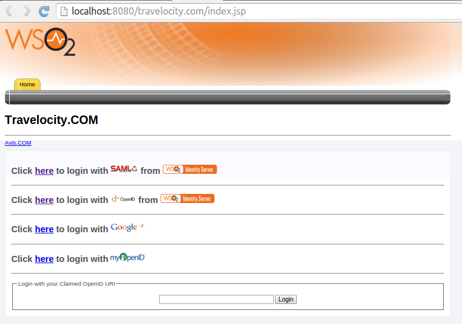

# Configuring Password Policy Authenticator

The Password Policy authenticator allows you to reset the password
during the authentication flow, if the password is expired, user will be
prompted to reset the password.

!!! note
    If you are using Password Policy Authenticator version 1.0.8, go to
    the WSO2 identity-outbound-auth-passwordPolicy [GitHub
    repository](https://github.com/wso2-extensions/identity-outbound-auth-passwordPolicy/tree/v1.0.8/docs)
    to view the latest documentation.


## Deploying Password Policy artifacts

1.  Download the [Password Policy Authenticator and
    artifacts](https://store.wso2.com/store/assets/isconnector/details/502efeb1-cc59-4b62-a197-8c612797933c)
    from the WSO2 connector store.

2.  Add the following lines to the
    `            deployment.toml           ` file in the
    `            <IS_HOME>/repository/conf/identity/           `
    directory `            .           `

    ```toml
    [[event_handler]]
    name= "passwordExpiry"
    subscriptions =["POST_UPDATE_CREDENTIAL", "POST_UPDATE_CREDENTIAL_BY_ADMIN", "POST_ADD_USER"]
    [event_handler.properties]
    passwordExpiryInDays= "30"
    enableDataPublishing= false
    priorReminderTimeInDays= "0"
    ```

3.  Place the authentication pwd-reset.jsp file  into the
    `            <IS_HOME>/repository/deployment/server/webapps/authenticationendpoint           `
    directory.

    !!! note
        Before pasting the pwd-reset.jsp file, the server needs to be
        started at least once to ensure that the folder is available for the
        web app to be deployed.
    

4.  Place the authenticator .jar file (
    `            org.wso2.carbon.extension.identity.authenticator.passwordpolicy.connector-1.0.3.jar           `
    ) into the directory
    `            <IS_HOME>/repository/components/dropins           ` . (
    To download the authenticator, go to
    [https://store.wso2.com/store/assets/isconnector/passwordpolicy](https://store.wso2.com/store/assets/isconnector/details/502efeb1-cc59-4b62-a197-8c612797933c)
    )

    !!! note
        If you want to upgrade the Password Policy Authenticator in your
        existing IS pack, please refer [upgrade
        instructions.](../../develop/upgrading-an-authenticator)
    

5.  Edit the `            identity-mgt.properties           ` found in
    the `            <IS_HOME>/repository/conf/identity           `
    directory and add the following property. This value must be an
    integer.

    ``` java
    Authentication.Policy.Password.Reset.Time.In.Days=20
    ```

    !!! info 
        If the property is not added to the file, by default, the password
        reset time is 30 days.

## Add claim mapping

A claim is a piece of information about a particular subject. It can be
anything that the subject is owned by or associated with, such as name,
group, preferences, etc. In this instance, the claim in question is
`         lastPasswordChangedTimestamp        ` and this needs to be
linked to a claim that is local to WSO2 Identity Server. This claim is
required because the WSO2 Identity Server needs to know if the password
is expired or not for this flow to work.

!!! info 
	For more information about claim mappings, see [Adding a claim
	mapping](../../learn/adding-claim-mapping).

1.  Navigate to the **Identity** section under the **Main** tab of the
    [management
    console](../../setup/getting-started-with-the-management-console)
    .
2.  Click **Add** under **Claims** and then click **Add Local Claim**.
3.  Add a new claim for
    `           lastPasswordChangedTimestamp          ` with
    `                       http://wso2.org/claims/lastPasswordChangedTimestamp                     `
    as the **Claim Uri.**

	!!! info 
		When adding a new claim, use an attribute which is mapped to an
		existing unused claim if the secondary user-store is an LDAP and use
		any attribute name as the mapped attribute if it is a JDBC user
		store.

       

## Deploying travelocity sample application

Follow this guide to
[deploy and configure the `travelocity.com` sample app](../../learn/deploying-the-sample-app/#deploying-the-travelocity-webapp)
in order to use it in this scenario.

## Configuring the Service Provider

The next step is to configure the service provider.

1.  In the previous section you have
    [configured a service provider](../../learn/deploying-the-sample-app/#configuring-the-service-provider)
    in WSO2 Identity server. Now edit the service provider to configure
    password reset.

7.  Go to **Local and Outbound Authentication Configuration** section.

8.  Select the **Advanced** **configuration** radio button option .

9.  Add the basic authentication as first step and
    password-reset-enforcer authentication as second step.

    !!! tip
        The **Use attributes from this step** option is unchecked
        when the second step is added and selected.

    

You have now added and configured the service provider.

## Testing the sample

1.  To test the sample, the password needs be expired. So select
    "Supported by Default" checkbox in the
    `           lastPasswordChangedTimestamp          ` that has the
    **http://wso2.org/claims/lastPasswordChangedTimestamp** claim.

    !!! note
        In a production setup, you need to **deselect** "Supported by
        Default" checkbox in the lastPasswordChangedTimestamp claim mapping
        configuration.
    

       

2.  Enter a date and time of the past for the Password Changed Time
    field. Make sure to provide the value in the Epoch format.  
     
3.  Go to the following URL: http://localhost:8080/travelocity.com
4.  Click the link to log in with SAML from WSO2 Identity Server.  
    

5.  The basic authentication page appears. Use your WSO2 Identity Server
    credentials.

6.  During the authentication flow, if the password is expired, you will
    be prompted to reset the password.  
     
7.  Enter the current password, new password and repeat password. If the
    authentication is successful, you are taken to the home page of the
    travelocity.com app.
