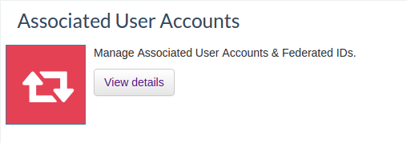

# Associating User Accounts

WSO2 Identity Server (WSO2 IS) allows you to associate multiple accounts
you may have, and switch between accounts once you associate accounts.
WSO2 IS also allows you to connect your federated user credentials with
your WSO2 Identity Server account. This topic provides instructions on
how to associate all your user accounts to the account with which you
have logged on.

!!! note
    If you want to associate user accounts of federated users via the
    dashboard, add the following configuration to the `/repository/conf/deployment.toml`
    file.
    
    ``` toml
    [user.association]
    enable_for_federated_users = true
    ```    

    The **recommended approach** is to have the `enable_for_federated_users` parameter set to `false` so that manual federated user association is not allowed by default via the dashboard.
        

  
Follow one of the two approaches below to associate all your user
accounts:

## Using the AdminService

The first approach is to use the `         AdminService        ` . You
can access this admin service using the following URL: '
`         https://<HOST_NAME>:9443/services/UserAccountAssociationService?wsdl        `
'. If you are new to admin services, see [Calling Admin
Services](../../develop/calling-admin-services).

The following actions can be performed using above admin service.

-   Create a new user account association
-   Delete an existing user account association
-   Get all associated user accounts of the logged in user
-   Switch between associated user accounts without re-authenticate with
    the system

## Using the dashboard

The WSO2 Identity Server [end user
dashboard](../../learn/using-the-end-user-dashboard) can be used to associate the
accounts. You can associate a local user account or a federated user
account:


### Managing local user IDs

1.  Go to the dashboard URL: <https://localhost:9443/dashboard/>
2.  Log in using your username and password.
3.  Click the **View details** button that corresponds to the
    **Associated User Accounts** gadget.  
     
4.  You can see all associated accounts of the user that you logged in
    as. This table includes the user ID and identity provider of all the
    associated user accounts of the user.  
     
5.  You can initiate a new user account association by clicking the
    **Add Association** button under **Associated Accounts**.
6.  Select **Local** as the **Account Type**, and enter the username
    and password of the user account that you want to connect to.  
    Click **Associate** to associate this user account.  If it is
    authentic, WSO2 Identity Server authenticates the user account and
    saves that user account as an association to the user account of the
    logged in user.  
     
7.  You can delete this user account association by clicking **Remove**
    in the **Associated Accounts** list.
8.  You can also switch between associated user accounts without having
    to re-authenticate the user account with the Identity Server. In the
    user dashboard UI, the associated user accounts appear under the
    dropdown list at the top right corner of your screen. You can switch
    between accounts by selecting the required user account from the
    dropdown. Note that the session key does not change during this
    operation.  
     

### Managing federated user IDs

You can connect your federated user IDs with your WSO2 Identity Server
account from the end user dashboard. To set this up, do the following.

!!! note
    You need to setup an Identity Provider before continuing this process.
    For more information on how to do this, see [Adding and Configuring an
    Identity Provider](../../learn/adding-and-configuring-an-identity-provider).
    

1.  Go to the dashboard URL: <https://localhost:9443/dashboard/>
2.  Log in using your username and password.
3.  Click the **View details** button that corresponds to the
    **Associated User Accounts** gadget.  
     
4.  You can see all associated accounts of the user that you logged in
    as. This table includes user ID and the identity provider of all
    associated user accounts of the user.  
     
5.  You can initiate a new user account association by clicking the
    **Add Association** button under **Associated Accounts**.
6.  Select the **Federated** as the **Account Type** from the dropdown
    provided, and enter the username and password.  
    Click **Associate** to connect this user account to the WSO2
    Identity Server account of the logged in user.  
     
7.  You can delete this user account association by clicking **Remove**
    on the **Associated Accounts** list.
