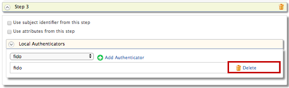
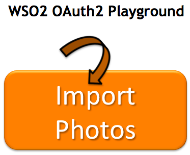

# Configuring ACR-Based Adaptive Authentication

This scenario demonstrates Authentication-Context-Reference-based
(ACR-based) adaptive authentication in WSO2 Identity Server using sample
authenticators. The instructions below guide you through specifying
authentication steps based on the authentication context value used when
logging in.

Follow the instructions given in the sections below to set this up.

!!! tip "Before you begin"
    
	-   Set up the OAuth2 Playground sample application for adaptive
		authentication. For instructions on how to do this, see [Setting Up
		the Sample Webapp](../../learn/deploying-the-sample-app/#deploying-the-playground2-webapp).
	-   For more information about adaptive authentication with WSO2
		Identity Server, see [Adaptive Authentication](../../learn/adaptive-authentication).

### Configuring the service provider

1.  Before you begin this guide you should [deploy and
    register](../../learn/deploying-the-sample-app/#configuring-the-service-provider_1) the `playground2` webapp.
    Let's edit the same service provider to configure **ACR-Based**.
    authentication flow.
    
2. Expand **Local and Outbound Configuration** and click **Advanced 
   Configuration**.
   
3.  Click on **Templates** on the right side of the **Script Based
    Conditional Authentication** field and then click **ACR-Based**.  
    
4.  Click **Ok**. The authentication script and authentication steps are
    configured.

5.  The authentication steps that are added are ` totp ` and ` fido ` .
    However, these are authentication steps that you would normally use
    in production. To try out this scenario sample authenticators with
    the sample application, delete the ` totp ` and ` fido `
    authenticators and add the following demo authenticators instead.
    
    1.  Click **Delete** to remove the `            totp           `
        authenticator from Step 2 (the second authentication step).  
        
    2.  Select **Demo Hardware Key Authenticator** and click **Add**.  
        
    3.  Click **Delete** to remove the `            fido           `
        authenticator from Step 3.  
        
    4.  Select **Demo FaceID Authenticator** and click **Add**.  
        
        
6. Click **Update**.

!!! info
	The authentication script prompts authentication steps based on the acr
	values as follows.
	
	-   'acr1' - step 1 (basic authentication)
	-   'acr2' - step 1 and 2 (basic authentication and demo hardware key
		authenticator)
	-   'acr3' - step 1 and 3 (basic authentication and demo faceID
		authenticator)

### Trying out the scenario

1.  Access the following sample Playground application URL:
    <http://wso2is.local:8080/playground2/index.jsp> .  
2.  Click **Import Photos**.  

    
    
3.  Enter the client ID of the OAuth service provider application you
    registered above and enter 'acr2' as the **Authentication Context
    Class** value.  
    Leave the rest of the configurations as they are.  
    
4.  You are now prompted for basic authentication. Sign in with a user's
    credentials or use the admin/admin credentials to log in.  
    
5.  Since the ACR value entered was 'acr2', you are now also prompted
    for hardware key authentication as per the authentication script.

    !!! tip
    
        You can re-try this flow using the ACR value 'acr3'. Note that you
        are then prompted for step 1 and 3 (basic authentication and Demo
        FaceID authentication).
    
    

6.  Provide the required consent.  

    	
    
7.  You are now successfully logged in to the application. You can click
    the **Logout** button to log out and try this flow with different
    ACR values.  
    

!!! Tip 
    Read more about ACR and AMR
    [here](../../learn/working-with-acr-and-amr)
