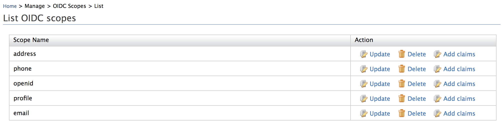
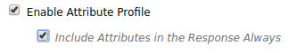

# Configuring Claims for a Service Provider

Claim mapping for a service provider involves mapping claims that are
used by the service provider to the claims local to the WSO2 Identity
Server. For the occasions where a service provider needs some
information of the user from the Identity Server where the service
provider authenticates, the claim mapping is useful. Once the user is
authenticated, the service provider can use these received claim details
to provide its service.  See the [Identity Server
Architecture](../../get-started/architecture) for more
information on how claim mapping fits in to the overall scheme of
things.

To register a service provider, do the following.

1.  Sign in. Enter your username and password to log on to the Management Console. 
2.  Click **Add** under **Service Providers** on the **Main** menu.
3.  Fill in the **Service Provider Name** and provide a brief **Description** of the service provider. Only **Service Provider Name** is a required field.
4.  Click **Register** to add the new service provider.

### Claim mapping

1.  In the **Claim Configuration** form, select the claim mapping
    dialect by either choosing to use a local claim dialect or define
    your own custom claim dialect.  
    
    1.  If you choose to **Use Local Claim Dialect**, you need to fill
        in the following details.

        1.  Fill in your requested claims by clicking the **Add Claim
            URI** button.
        2.  Choose your **Local Claim** from the drop-down. Select
            whether this claim is a **Mandatory Claim** for the Service
            Provider using the checkbox.  
            

    2.  If you choose to **Define Custom Claim Dialect**, you need to
        do the following.

        1.  Add a custom claim URI by clicking on the **Add Claim URI**
            button. Clicking this button again enables you to map more
            claims.

        2.  Add the **Service Provider Claim** and choose the
            corresponding **Local Claim** from the drop-down. Select
            whether you want the claim to be a **Requested Claim** and
            whether this claim is a **Mandatory Claim** for the service
            provider, using the relevant checkboxes.

            

2.  Select the **Subject Claim URI** and the **Role Claim URI** (for
            custom claims)from the drop-down. The claims you mapped are listed
            in the drop-down and you can choose among these claims.

    !!! info 
        -   **Subject Claim URI** defines the authenticated user identifier
            which will return with the authentication response to the
            service provider.
        -   **Role Claim URI** defines the role claim for the service
            provider. This is useful if you use a different claim as the
            role claim or if you define a custom claim mapping for the
            service provider.
            
            
    ??? note "Click to view vital information when configuring claims for an OpenID Connect Service Provider"
        When mapping custom claims for a service provider
        configured with OpenID Connect, ensure to map the custom
        claims in the SP configuration as seen in the screenshot
        above **AND** also add the custom claims to a scope value in
        the **oidc** file.
    
        !!! info "Why?"
    
            This is required because OpenIDConnect claim scopes are
            supported from WSO2 IS 5.2.0 onwards. This means that when
            you request for an OIDC token, you can specify a single
            scope value that is bound to a set of multiple claims. When
            that OIDC token is sent to the UserInfo endpoint, only the
            claims which are common in **both** the OIDC scope config
            file and the SP claim configuration (i.e., the intersection
            of claims in both these configurations) will be returned.
            
        To do this,

        1.  Click on **List** under **OIDC Scopes** under the **Manage** section of the **Main** tab of the management console.

        2.  Add the custom claims to the existing default scope
            **openid** by clicking on **Edit.** Alternatively, add a
            new scope for the custom claims by clicking on **Add New
            Property** and send it when getting the OIDC token along
            with the mandatory **openid** scope when getting the OIDC token.
            

        OIDC considers `address` as a JSON object. Therefore, if you
        want to pass an address using a different claim other than
        the address claim that is already available, you can do it
        using any of the following methods:

        The values do not have to be added in complex object format. 

        -   Without using the `address.` prefix.  
                For this, you need to register a scope named `address` in
                the WSO2 Identity Server's registry and add the value as
                the street or lane or any preferred value.

        -   Create a new external claim using the
                `                  address                ` prefix . Let's a look at how to create a new claim for the `address` prefix.
            1.  Click **Add** under Claims.
            2.  Click **Add External Claim**.
            3.  Select ` http://wso2.ord/oidc/claim ` as the value for **Dialect URI**.
            4.  Enter `   address.street    ` as the value for **External Claim URI**. 
                You can enter any value with the prefix ` address. `, such as `  address.country `,
                ` address.lane  `, and much more.
            5.  Map the claim you are creating to any claim within WSO2 Identity server.  
                For example, you can map it to ` http://wso2.org/claims/location `.

        Now you can see the claim you created being listed. It is created as a JSON object in WSO2 Identity Server.
            
    ??? note "Click to view vital information when configuring claims for an SAML2 Service Provider"
        When mapping custom claims for a service provider configured with SAML2, ensure to **select both** " Enable Attribute Profile " and " Include Attributes in the Response Always" from the SAML2 service provider configuration as follows.
    
        
    
        !!! info "Why?"
                This is required since Identity Server include user claims
                in the SAML2 response only if SAML2 attribute profile is
                enabled.
            

### Mandatory claims

The **Local Claim** list includes a set of standard claim values which are local to the WSO2 Identity Server. When
adding a service provider, it is necessary to map the values of the claims local to the service provider with those
provided in this drop-down list which are local to the Identity Server. This should be done for all values in the
service provider unless they use the same claim name.

Marking a claim as a **Mandatory Claim** would ensure that
the WSO2 IS will definitely send a value for this claim to
the service provider.  When a user logs into this service
provider, if the identity provider does not provide a value
for any of the mandatory claims, the user will be prompted
to provide them at the time of login as shown in the image
below.  

??? tip "Testing mandatory claims"
    To test out mandatory claims,
        
    1.  Configure the travelocity sample application by
        following the steps in the [Deploying the Sample App](../../learn/deploying-the-sample-app/#deploying-the-travelocity-webapp). 
        
    2.  Configure a few claims and select the checkbox for
        mandatory claims.

    3.  Ensure that there are one or more claims which are
        missing in the user profile of the user you wish to
        login with.

    4.  Run the travelocity sample and try the SAML login.

    5.  Log in with the user credentials of the user who has a
        few mandatory claims missing, and click **Submit**.
    6.  A claim request will be prompted, Similiar to the image
        below. At this point, the mandatory claim rule is
        enforced and you cannot proceed without providing the
        necessary claim values. Provide the necessary claim
        values and click **Submit**.
    7.  You will be successfully logged in to the application.


Marking a mapped claim as a **Requested Claim** would ensure
that the service provider definitely sends this claim to the
Identity Server. This is useful particularly in cases where
there are hundreds of claims and only specific ones need to
be sent to the Identity Server.

**Collecting consent for requested and mandatory claims**

When the user is authenticated to the application, claims
that are indicated as required and/or mandatory in this
claim configuration form will be displayed in the consent
request UI to prompt for the user’s consent. If a claim is
indicated as a mandatory claim, it will be indicated with a
red color asterix ( \* ) when requesting consent. The user
will not be able to proceed with authentication without
providing consent for the mandatory claims.

For more information about consent management during
authentication, see [Consent Management with
Single-Sign-On](../../learn/consent-management-with-single-sign-on).

### Caching service provider claims
If you want to cache claim data,add a cache configuration
similar to the following
`         <IS_HOME>/repository/conf/deployment.toml       ` file:

``` toml
[[cache.manager]]
name = "LocalClaimInvalidationCache"
timeout = "300"
capacity = "5000"
```

Here, you need to specify values as follows:

-   ` timeout ` : The cache timeout value in seconds.
-   ` capacity ` : The maximum cache size.


!!! info "Related Topics"
    See [Logging in to Salesforce with
        Facebook](../../learn/logging-in-to-salesforce-with-facebook) for a
        sample of claim mapping for a service provider.
