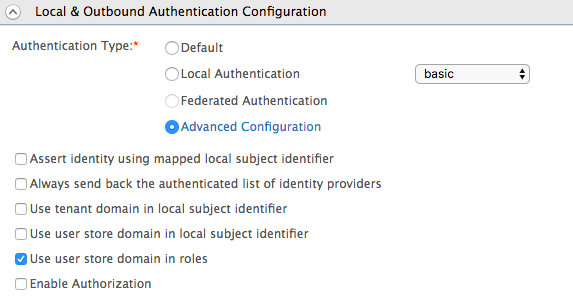

# Configuring Multi-factor Authentication with Username and Password

This scenario involves obtaining the username first and validating that
prior to autenticating the user using the password.

1.  Log in to the [Management
    Console](../../setup/getting-started-with-the-management-console).
2.  Navigate to the **Main** menu to access the **Identity** menu. Click
    **Add** under **Service Providers**.
3.  Create a new Service Provider:

    !!! info 
        For more information on creating a service provider, see [Adding and
        Configuring a Service
        Provider](../../learn/adding-and-configuring-a-service-provider).

    1.  Fill in the **Service Provider Name** and provide a brief
        **Description** of the service provider. Only **Service Provider
        Name** is a required field.
    2.  Click **Register** to add the new service provider.

4.  Access the service provider you just created and expand **Local &
    Outbound Authentication Configuration**.

    !!! info 
        For more information on configuring the local and outbound
        authentication configuration, see [Configuring Local and Outbound
        Authentication for a Service
        Provider](../../learn/configuring-local-and-outbound-authentication-for-a-service-provider)
        .

    

      

5.  Select **Advanced Configuration** to configure multi-factor
    authentication.
6.  Click **Add Authentication Step**. Then add a local authenticator
    from **Local Authenticators** section. Select **identifier** from
    the dropdown. This is used to identify the user.

    !!! note
    
        **Note** : The identifier is not an authenticator, so having only
        the identifier in the authentication flow will fail the
        authentication. If there are no authenticators configured other than
        identifier, an error occurs when updating the service provider.
    

7.  Click **Add** **Authentication** **step** and add the **basic**
    authenticator from **Local Authenticators** section.  This will
    enable the password as the 2nd step authenticator.  
    
8.  Click the **Update** button. This navigates you to the previous
    screen with your newly configured authentication steps.

    !!! tip     
        However, by default, the username is not validated and WSO2 Identity
        Server does not check whether it exists in the userstore. This can be
        configured by setting the following parameter in the
        `          <IS_HOME>/repository/conf/deployment.toml    ` file as shown below.

        ``` xml
        [authentication.authenticator.user_identifier] 
        name ="IdentifierExecutor"
        enable=true
        [authentication.authenticator.user_identifier.parameters]
        validate_username= false
        ```
        

  

### Try it out

1.  Access the following sample PickUp application URL:
    <http://localhost.com:8080/saml2-web-app-pickup-dispatch.com>
2.  Enter the username and click **NEXT**.  
    
3.  Enter the password and click **SIGN IN**.  
    

  
