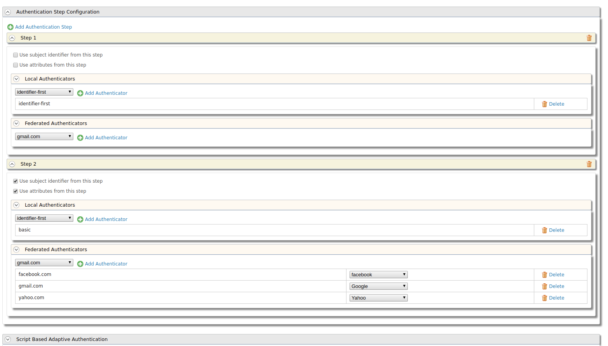

# Identifier-first Flow Handler

The identifier-first login enables identifying the individuals prior to authenticating them. It is used to get the identity of the user without using authentication information, and use that identity to control the authentication flow.

!!! info 
    The identifier-first flow handler is shipped with the product itself from IS 5.7.0 onwards.

## Configuring Identifier-first handler in the login flow

!!! warning
    This handler can be configured at any step in the authentication flow. However, it is not an authenticator by itself and needs to be configured along with another authenticator in order for the authentication process to be successful.

1.  Make sure that the `validate_username parameter` in the `IS_HOME/repository/conf/deployment.toml` file is set to true if you want your user name validated first.

    ```toml
    [authentication.authenticator.user_identifier] 
    name ="IdentifierExecutor"
    enable=true
    [authentication.authenticator.user_identifier.parameters]
    validate_username= true
    ```
2.  Log in to the WSO2 IS [management console](../../setup/getting-started-with-the-management-console/). Select a Service Provider (For details on how to create a new service provider, click [here](../../learn/adding-and-configuring-a-service-provider)) and expand the **Local & Outbound Authentication Configuration** section. Click **Advanced Configuration**.

    a.  Add an authentication step and select `identifier-first`.
    b.  Add another authentication step and select `basic`.


## Let's try this out for a scenario!

Suppose the admin wants the user who attempts to log in, to be authenticated by a federated authenticator that is chosen based on the specified domain name. Let's also assume that the user has opted to validate the identity before proceeding to authenticate the user. 

Follow the steps given below to accomplish this. 

!!! tip "Before you begin"
    
    1.  Install WSO2 IS by downloading the [installer](https://wso2.com/identity-and-access-management/)

    2.  Navigate to `<IS_HOME>/repository/conf/deployment.toml` file. Set `enable_email_domain` to true to enable email authentication. By doing this, we are configuring WSO2 IS to use the email as the user name.

        ```toml
        [tenant_mgt]
        enable_email_domain= true
        ```

    3.  [Download](https://tomcat.apache.org/download-80.cgi) and install Apache Tomcat version 8.*.* or above.

    4.  Open the /etc/hosts file and add the following entry.

        ```bash
        127.0.0.1 localhost.com
        ```
    5.  Restart WSO2 Identity Server.

1.  Download the saml2-web-app-pickup-dispatch.com.war file from [saml2-web-app-pickup-dispatch.com.war](https://github.com/wso2/samples-is/releases) and copy it inside the <TOMCAT_HOME>/webapps directory.

2.  Start the tomcat server.  

3.  In the WSO2 IS [management console](https://localhost:9443/carbon/admin/login.jsp), create a new service provider and expand **Inbound Authentication configuration**. Select **SAML2 Web SSO configuration**, and click **Configure**.

4.  Provide the following details and register.
    -   **Issuer**- \saml2-web-app-pickup-dispatch.com
    -   **Assertion Consumer URL**- \http://localhost.com:8080/saml2-web-app-pickup-dispatch.com/consumer

5.  Access the PickUp application URL at <http://localhost.com:8080/saml2-web-app-pickup-dispatch.com>. The login screen should only prompt for the user name. Once you enter the correct user name, you will be directed to the next screen where you are requested to enter the password.
    

6.  Now let's try to incorporate a federated authenticator to this scenario. In the management console, configure the federated authenticators required. For instructions on configuring a federated authenticator, see [here](../../learn/configuring-federated-authentication/).  

7.  Open the Service Provider you created in step 3 and proceed to the **Advanced Configuration**. Expand  **Local & Outbound Authentication Configuration**, add identifier-first as the first step and, add all the federated authenticators as another step.  



8.  Add the following script to **Script Based Adaptive Authentication** in the **Advanced Configuration** of the Service Provider. This extracts the domain name from the user name in the first step and uses that particular domain as the authenticator in the second step. 

```java 
var federatedDomains = ['facebook.com', 'yahoo.com', 'gmail.com'];
function onLoginRequest(context) {
 executeStep(1, {
    onSuccess: function (context) {
       var username = context.steps[1].subject.username;
       var indexOfLastAt = username.lastIndexOf("@");
       var domain = username.substring(indexOfLastAt + 1);
       if (federatedDomains.indexOf(domain) >= 0) {
          executeStep(2,{authenticationOptions:[{idp:domain}]}, {});
       } else {
          executeStep(2,{authenticationOptions : [{authenticator:'basic'}]} , {});
       }
    }
 });
}
```

Now you can access the sample app using any of the configured federated authenticators, by entering the user name followed by the authenticator (for example, jake@gmail.com). You can either disable the `validate_username` property and test it with any name or you can create a user in the console. See more details on how to use an email address as the user name [here](../../learn/using-email-address-as-the-username).
