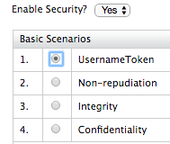
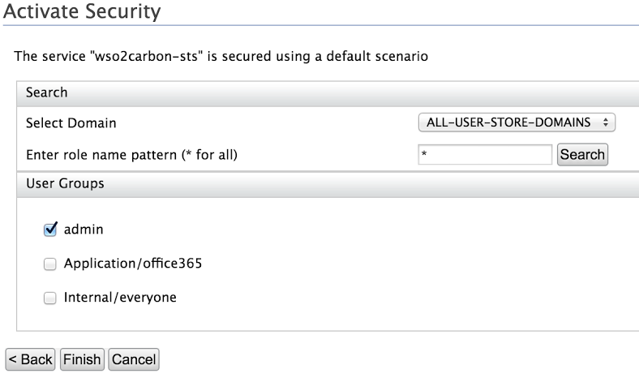

# Logging in to Office365 with WS-Trust

The WSO2 Identity Server allows you to configure and federate the
Office365 Active STS client (based on the WS-Trust protocol) for single
sign-on. The WSO2 IS supports the following Office365 Active STS
clients.

-   Skype for Business Desktop Client (Lync)

-   Skype for Business Mobile client

-   OneDrive for Desktop Business client  

!!! note
	These Office365 Active STS clients send two types of requests to the
	WSO2 identity provider during the authentication process.

	-   Metadata Exchange (MEX)
	-   Secure Token Service Request (STS)

	#### Metadata Exchange

	Clients such as Skype for Business and OneDrive use the [WS-Metadata
	exchange
	specification](http://specs.xmlsoap.org/ws/2004/09/mex/WS-MetadataExchange.pdf)
	, which is basically a service endpoint that exposes metadata about the
	service. As the first step of the authentication process, the Active STS
	client sends a Metadata request to the WSO2 Identity
	provider. The MetadataExchange service endpoint is shipped with WSO2
	Identity Server to cater to the authentication requirements of the
	Office365 active clients. For more information on understanding
	WS-MetaData Exchange, see the following
	[article](http://wso2.com/library/2794/).

	#### Secure Token Service (STS)

	In simple terms, the client expects a security token from the users who
	are attempting to login using the WSO2 Identity Server. If the client
	demands or expects a secure token, the WSO2 IS needs to request and
	fetch the corresponding security token from a Secure Token Service. To
	do this, the [Secure Token Service
	specification](http://docs.oasis-open.org/ws-sx/ws-trust/v1.4/ws-trust.html)
	is used.

This topic provides instructions on how to configure and federate the
Office365 Active STS client for single sign-on, based on the WS-Trust
protocol, through the WSO2 Identity server. The following sections guide
you through the entire process.

### Prerequisites

-   Configure Azure Active Directory (AD) to trust WSO2 Identity Server.
    For more information on how to do this, see [Configuring Azure
    Active Directory toTrust WSO2 Identity
    Server](../../learn/configuring-azure-active-directory-to-trust-wso2-identity-server)
   .
-   Configure an Active Directory user store as the primary user store
    in WSO2 Identity Server. For more information on how to do this, see
    [Configuring an Active Directory User
    Store](../../setup/configuring-a-read-write-active-directory-user-store)
   .  
-   Configure WSO2 Identity Server to authenticate users using the email
    address as the username. For more information on how to do this, see
    [Using Email Address as the
    Username](../../learn/using-email-address-as-the-username)
   .

### Configuring Office 365 WS-Trust

1.  Start the WSO2 Identity Server and log in to the management console

2.  Click **Resident** under **Identity Providers** in the **Main**
    menu. Expand the **Inbound Authentication Configuration** section
    and then the **WS-Federation(Passive) Configuration.**

3.  Replace the value of the **Identity Provider Entity Id** with the
    value given for the parameter **$issueruri** when configuring Azure
    AD (configured in step 3 of [this
    topic](../../learn/configuring-azure-active-directory-to-trust-wso2-identity-server)
    ), and click **Update** to save changes.  
    In this sample scenario, the value for the Identity Provider Entity
    Id is https://wso2test.com.

    

4.  Navigate to **Claims\>Add** in the **Main** menu and click **Add New
    Claim**. Set 'User Principle' and 'ImmutableID' as claims as seen
    below. See [Adding Claim Mapping](../../learn/adding-claim-mapping) for more
    information.

    
    

5.  Navigate to **Claims\>List** and click on the
    [http://wso2.org/claims](https://localhost:9443/carbon/claim-mgt/claim-view.jsp?store=Internal&dialect=http%3A%2F%2Fwso2.org%2Fclaims)
    claim dialect. Click on **Edit** for each of the claims below and
    untick the **Supported by Default** checkbox.

    !!! info "Why do these claims need to be edited?"
		These attributes are not supported by Active Directory by default.
		Therefore if these attributes are ticked as **Supported by Default**
		in Identity Server, they will be shown in the default user profile
		and you will recieve an error once you try to update the user
		profile.

<!-- -->

1.  -   Country - http://wso2.org/claims/country

    -   Organization - http://wso2.org/claims/organization
    -   IM - http://wso2.org/claims/im

2.  Navigate to **Service Providers \> Add** in the **Main** menu and
    add a new Service Provider named ' Office365'.

3.  Expand the **Inbound Authentication Configuration** section, then
    the **WS-Trust Security Token Service Configuration** and click
    **Configure**.

4.  Enter the following details in the form that appears and click
    **Apply**. See [Configuring WS-Trust Security Token
    Service](../../learn/configuring-ws-trust-security-token-service) for more
    information about these fields.

    -   **Endpoint Address:**
        [urn:federation:MicrosoftOnline](http://urnfederationMicrosoftOnline)

    -   **Certificate Alias:** wso2carbon

    

5.  Expand the **Claim Configuration** section and configure the
    following attributes required by Azure AD as seen below.

    <table>
    <colgroup>
    <col style="width: 33%" />
    <col style="width: 33%" />
    <col style="width: 33%" />
    </colgroup>
    <thead>
    <tr class="header">
    <th>Service Provider Claim</th>
    <th>Local Claim</th>
    <th>Requested Claim</th>
    </tr>
    </thead>
    <tbody>
    <tr class="odd">
    <td><p><a href="http://schemas.xmlsoap.org/claims/UPN">http://schemas.xmlsoap.org/claims/UPN</a></p></td>
    <td><p><a href="http://wso2.org/claims/upn">http://wso2.org/claims/upn</a></p></td>
    <td><p>Ticked (True)</p></td>
    </tr>
    <tr class="even">
    <td><p><a href="http://schemas.microsoft.com/ws/2008/06/identity/claims/role">http://schemas.microsoft.com/ws/2008/06/identity/claims/role</a></p></td>
    <td><p><a href="http://wso2.org/claims/role">http://wso2.org/claims/role</a></p></td>
    <td><p>Ticked (True)</p></td>
    </tr>
    <tr class="odd">
    <td><p><a href="http://schemas.microsoft.com/LiveID/Federation/2008/05/ImmutableID">http://schemas.microsoft.com/LiveID/Federation/2008/05/ImmutableID</a></p></td>
    <td><a href="http://wso2.org/claims/objectguid">http://wso2.org/claims/objectguid</a></td>
    <td>Ticked (True)</td>
    </tr>
    </tbody>
    </table>

    

6.  Set the **Subject Claim URI** to the Immutable ID claim and the
    **Role Claim URI** to the role claim. Click **Update** to save
    changes to the service provider.

7.  Click **Resident** under **Identity Providers** in the **Main**
    menu. Expand the **Inbound Authentication Configuration** section,
    then the **Security Token Service Configuration** section and click
    **Apply Security Policy**.

8.  Select **Yes** in the **Enable Security** dropdown.

9.  Select **UsernameToken** under **Basic Scenarios** and click
    **Next**.

      

10. Select the **Admin** role checkbox from the User Groups and click
    **Finish**.

    !!! note
        It is not mandatory to select the ‘admin’ role for
        authentication of the UserNameToken. Any role having ‘login’
        permissions would be sufficient.
    
    

11. Click **Update** to save all changes.

12. Create a user and update the user's profile with a User Principle
    Name as seen below.

    !!! note
    
        ObjectGUID is a binary attribute. Add the following user store
        property to the
        `            <IS_HOME>/repository/conf/deployment.toml           ` file
        under the relevant user store tag in order to see the value properly
        in the management console.
    
		```java
		[user_store.properties]
		'java.naming.ldap.attributes.binary' = "objectGUID"
		``` 

    

### Testing Office365 WS-Trust with WSO2 IS

The **Skype for Business** client is used to demonstrate testing of this
scenario. You can test it with the user you created above. The user’s
identity will be represented and authenticated by the on premises
identity provider (i.e., the WSO2 Identity Server).

1.  Download and install the [Skype for Business
    client](https://support.office.com/en-us/article/Install-Skype-for-Business-on-your-PC-8a0d4da8-9d58-44f9-9759-5c8f340cb3fb)
    [.](https://support.office.com/en-us/article/Install-Skype-for-Business-on-your-PC-8a0d4da8-9d58-44f9-9759-5c8f340cb3fb)
2.  Enter the email address of the user you created as the **Sign-in
    address** and enter the password of the user.
3.  Click **Sign In.** The identity will be authenticated by the WSO2 IS
    and you will be successfully signed in to the Skype client.

??? note "Click here to troubleshoot"

	You might receive the following login error while you are trying to sign
	in to the Skype for Business client. This usually happens due to a DNS
	resolving issue.

	

	This issue can be resolved by manually configuring DNS settings of the
	Skype for Business client itself.

	1.  In the Skype for Business client, navigate to **Options \>
		Personal \> Advanced \> Manual configuration.**
	2.  Use the following value for both internal and external server.

		|                             |
		|-----------------------------|
		| sipdir.online.lync. com:443 |

		

	3.  Save and try logging in again. Now you should be able to login
		successfully.
