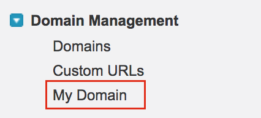
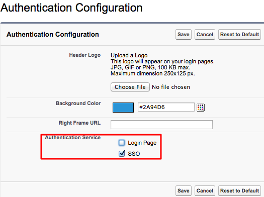
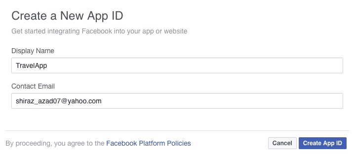
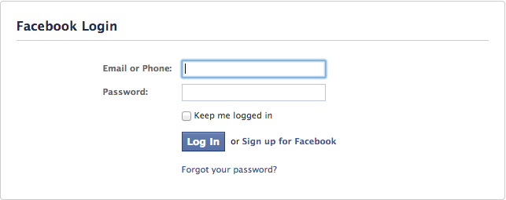

# Logging in to Salesforce with Facebook

This topic provides instructions on how to log into Salesforce using
your Facebook credentials. In this use case Salesforce is the service
provider while Facebook is the Identity Provider. If a user needs to log
in to Salesforce, WSO2 Identity Server sends the user details to
Facebook. Facebook authenticates the user credentials and if the user
exits in Facebook, the user is allowed to log in to Salesforce.

!!! tip "Before you begin!"  
    When you log into Salesforce, you normally use an email address. So, to
    integrate this with the Identity Server, you need to configure WSO2 IS
    to enable users to log in using their email addresses.
    
    ??? note "Click here to get the steps on how configure the email address as the username."
    
    		
    	!!! note
			Configuring the email address as the username in an **already running
			Identity Server** is not the production recommended way. Therefore,
			**make sure to configure it before you begin working with WSO2 IS**.
        

		1.  Open the `              <IS_HOME>/repository/conf/deployment.toml             `
			file.
		2.  Add  `               enable_email_domain              ` as shown below.

			```xml
			[tenant_mgt]
			enable_email_domain= true
			```

		3.  Open the `<IS_HOME>/repository/conf/claim-config.xml              `
			file and configure the `               AttributeID              `
			property of the
			`                               http://wso2.org/claims/username                             `
			claim ID that is under
			`               <Dialect dialectURI="                               http://wso2.org/claims                              ">              `
			to `               mail              `.

            !!! warning
				This file is checked only when WSO2 IS is starting for the first
				time. Therefore, if you haven't configured this property at the time
				of starting up the server for the first time, you will get errors at
				the start up.

			``` java
			<Claim>
			   <ClaimURI>http://wso2.org/claims/username</ClaimURI>
			   <DisplayName>Username</DisplayName>
			   <AttributeID>mail</AttributeID>
			   <Description>Username</Description>
			</Claim>
			```

		4.  Open the `               <IS_HOME>/repository/conf/identity/identity-mgt.properties               `
			file and set the following property to
			`               true              `.

			!!! info 
				This step is required due to a known issue that prevents the
				confirmation codes from being removed after they are used when email
				usernames are enabled. This occurs because the '@' character (and
				some special characters) are not allowed in the registry. To
				overcome this issue, enable hashed usernames when saving the
				confirmation codes by configuring the properties below.

			``` xml
			UserInfoRecovery.UseHashedUserNames=true
			```

			Optionally, you can also configure the following property to
			determine which hash algorithm to use.

			``` xml
			UserInfoRecovery.UsernameHashAlg=SHA-1
			```

		5.  Configure the following set of parameters in the user store
			configuration, depending on the type of user store you are connected
			to (LDAP/Active Directory/ JDBC).

			<table>
			<thead>
			<tr class="header">
			<th>Parameter</th>
			<th>Description</th>
			</tr>
			</thead>
			<tbody>
			<tr class="odd">
			<td><p><code>                    user_name_attribute                   </code></p>
			<p><br />
			</p></td>
			<td><div class="content-wrapper">
			<p>Set the mail attribute of the user. <strong>LDAP/Active Directory only</strong></p>
			<div class="code panel pdl" style="border-width: 1px;">
			<div class="codeContent panelContent pdl">
			<pre class="html/xml" data-syntaxhighlighter-params="brush: html/xml; gutter: false; theme: Confluence" data-theme="Confluence" style="brush: html/xml; gutter: false; theme: Confluence"><code>[user_store]<br>user_name_attribute = "mail"</code></pre>
			</div>
			</div>
			</div></td>
			</tr>
			<tr class="even">
			<td><code>                   user_name_search_filter                  </code></td>
			<td><div class="content-wrapper">
			<p>Use the mail attribute of the user instead of <code>                     cn                    </code> or <code>                     uid                    </code>. <strong>LDAP/Active Directory only</strong></p>
			<div class="code panel pdl" style="border-width: 1px;">
			<div class="codeContent panelContent pdl">
			<pre class="html/xml" data-syntaxhighlighter-params="brush: html/xml; gutter: false; theme: Confluence" data-theme="Confluence" style="brush: html/xml; gutter: false; theme: Confluence"><code>[user_store]<br>user_name_search_filter = "(&amp;(objectClass=identityPerson)(mail=?))"</code></pre>
			</div>
			</div>
			</div></td>
			</tr>
			<tr class="odd">
			<td><code>                   user_name_list_filter                  </code></td>
			<td><div class="content-wrapper">
			<p>Use the mail attribute of the user. <strong>LDAP/Active Directory only</strong></p>
			<div class="code panel pdl" style="border-width: 1px;">
			<div class="codeContent panelContent pdl">
			<pre class="html/xml" data-syntaxhighlighter-params="brush: html/xml; gutter: false; theme: Confluence" data-theme="Confluence" style="brush: html/xml; gutter: false; theme: Confluence"><code>[user_store]<br>user_name_list_filter = "(&amp;(objectClass=identityPerson)(mail=*))"</code></pre>
			</div>
			</div>
			</div></td>
			</tr>
			<tr class="odd">
			<td><pre><code>username_javas_cript_regex</code></pre>
			<p><code>                                       </code></p></td>
			<td><div class="content-wrapper">
			<p>Change this property that is under the relevant user store manager tag as follows. This property allows you to add special characters like "@" in the username.</p>
			<div class="code panel pdl" style="border-width: 1px;">
			<div class="codeContent panelContent pdl">
			<pre class="html/xml" data-syntaxhighlighter-params="brush: html/xml; gutter: false; theme: Confluence" data-theme="Confluence" style="brush: html/xml; gutter: false; theme: Confluence">
			<code>[user_store]<br>username_javas_cript_regex="^[a-zA-Z0-9._-]+@[a-zA-Z0-9.-]+\.[a-zA-Z]{2,4}"</code></pre>
			</div>
			</div></td>
			</tr>
			
			
			<tr class="even">
			<td><pre><code>username_java_regex</code></pre></td>
			<td><div class="content-wrapper">
			<p>This is a regular expression to validate usernames. By default, strings have a length of 5 to 30. Only non-empty characters are allowed. You can provide ranges of alphabets, numbers and also ranges of ASCII values in the RegEx properties.</p>
			<div class="code panel pdl" style="border-width: 1px;">
			<div class="codeContent panelContent pdl">
			<pre class="html/xml" data-syntaxhighlighter-params="brush: html/xml; gutter: false; theme: Confluence" data-theme="Confluence" style="brush: html/xml; gutter: false; theme: Confluence">
			<code>[user_store]<br>username_java_regex="^[a-zA-Z0-9._-]+@[a-zA-Z0-9.-]+\.[a-zA-Z]{2,4}$"</code></pre>
			</div>
			</div>
			</div></td>
			</tr>
			
			
			<tr class="odd">
			<td>Realm configurations</td>
			<td><div class="content-wrapper">
			<p>The <code>                     super_admin                    </code> username must use the email attribute of the admin user.</p>
			<div class="code panel pdl" style="border-width: 1px;">
			<div class="codeContent panelContent pdl">
			<pre class="html/xml" data-syntaxhighlighter-params="brush: html/xml; gutter: false; theme: Confluence" data-theme="Confluence" style="brush: html/xml; gutter: false; theme: Confluence">
			<code>[super_admin]<br>  username="admin@wso2.com"<br>Password= "admin"</code></pre>
			</div>
			</div>
			<div class="admonition note">
			<p class="admonition-title">Note</p>
			<p>Before this configuration, the user having the username <strong>admin</strong> and password <strong>admin</strong> was considered the super administrator. The super administrator user cannot be deleted.</p>
				<p>After this configuration, the user having the username <strong><code>                      admin@wso2.com                     </code></strong> is considered the super administrator. The user having the username admin is considered as a normal administrator.<br />
				</p></div>
			<div class="admonition tip">
			<p class="admonition-title">Tips</p>
			<p>If you changed the password of the admin user to something other than 'admin', start the WSO2 IS server using the -Dsetup parameter as shown in the command below.</p>
			<div class="code panel pdl" style="border-width: 1px;">
			<div class="codeContent panelContent pdl">
			<div class="sourceCode" id="cb10" data-syntaxhighlighter-params="brush: java; gutter: false; theme: Confluence" data-theme="Confluence" style="brush: java; gutter: false; theme: Confluence"><pre class="sourceCode java">
			<code class="sourceCode java">sh wso2server.sh -Dsetup</code></pre></div>
			<p></p>
			</div>	
			</div>
			</div>
			</div></td>
			</tr>
			</tbody>
			</table>
			
			!!! info 
				With these configuration users can log in to super tenant with both
				email user name ( *[bob@gmal.com](mailto:bob@wso2.com)* ) or
				non-email user names (alice). But for tenant only email user names
				allowed (tod@ [gmail.com](http://gmail.com) @
				[wso2.com](http://wso2.com) )

			!!! note
				You can configure email user name without enabling
				**`                EnableEmailUserName               `** property,
				then users can login to both super tenant and tenant using email and
				non-email user names. But super tenant users should always use
				***@carbon.super*** at the end of user names.
	

		6.  Restart the server.

		!!! info "Related Topics"
			For more information on how to configure primary and secondary user
			stores, see [Configuring User
			Stores](../../setup/configuring-user-stores).


Let's get started!

<a name="configuring-salesforce"></a>

## Configuring Salesforce

1.  Sign up as a Salesforce developer if you don't have an account. If
    you already have an account, move on to step 2 and log in to
    Salesforce.
    1.  Fill out the relevant information found in the following URL:
        <https://developer.salesforce.com/signup>
    2.  Click **Sign me up**.
    3.  You will receive a security token by email to confirm your new
        account. If you did not receive the email successfully, you will
        be able to reset it by following the steps given
        [here](https://help.salesforce.com/apex/HTViewHelpDoc?id=user_security_token.htm&language=en_US)
       .
2.  Log in with your new credentials as a Salesforce developer. Do this
    by clicking the **Login** link in the top right hand side of
    [https://login.salesforce.com/](https://login.salesforce.com/?lt=de)
   .

    !!! note
        This document is explained using the Salesforce lightning theme. If
        you are using the classic theme, follow the steps given below to
        switch to the lightning theme:
    
        ??? note "Click here to find the steps on how to switch from the classic to the lightning theme."
			1.  Click your username to expand the drop down.
			2.  Click **Switch to Lightning Experience**.  
				
			3.  Click the settings icon on the top-right-hand corner, and click
				**Set Up**.  
				
	
			Now you are navigated to the lightening theme of Salesforce.
	

3.  Click **Allow** to enable Salesforce to access your basic
    information.
4.  Once you are logged in, create a new domain and access it.

    To do this, do the following steps.

    1.  Search for My Domain in the search bar that is on the left
        navigation panel.  
        
        
    2.  Click **My Domain**.
    
    3.  In the page that appears, come up with a name for your domain.
        You can check if the domain is available by clicking the **Check
        Availability** button.
		
		!!! info
			For the page given below to load on your browser, make sure that
			the Salesforce cookies are not blocked.

        

    4.  If the domain is available, select **I agree to Terms and
        Conditions** and click **Register Domain** to register your new
        domain.

    5.  Once the domain is registered to your account, click the **Click
        here to login** button to test this out.

5.  On the left navigation menu, search for **Single Sign-On Settings**
    , and click it.
    
6.  In the page that appears, click **Edit** and then select the **SAML
    Enabled** check box to enable federated single sign-on using SAML.  
        
    
7.  Click **Save** to save this configuration change.

8.	Obtain<a name="salesforce-step8"></a> the Salesforce certificate. You need to upload it to the
    Identity Server later on. Follow the steps given below to obtain the
    certificate.

    !!! info "About the Salesforce certificate"
		The validation request sent from Salesforce must be validated by the
		Identity Server. For this purpose, the Salesforce public certificate
		must be uploaded to the Identity Server and is used to validate the
		request.

    1.  On the left navigation menu, go to **Security Controls** and
        click **Certificate and Key Management**.
        
    2.  If you have not done so already, you must create the certificate
        first. Do the following steps to create this.
        1.  Click **Create Self-Signed Certificate**.
        2.  Enter the **Label** and a **Unique Name**, and click
            **Save**. The certificate is generated.
            
    3.  Click the **Download Certificate** button to download the
        certificate.

9.  <a name="samlsinglesignon"></a>Click **New** under **SAML Single Sign-On Settings**. The following
    screen appears.  
    
    
    Ensure that you configure the following properties.

    !!! tip
        If you want to know more about the Salesforce SAML Single Sign-On
        settings configurations, see the [Salesforce developer
        documentation](https://developer.salesforce.com/docs/atlas.en-us.sso.meta/sso/sso_saml.htm)
    
    
    <table>
    <thead>
    <tr class="header">
    <th>Field</th>
    <th>Value</th>
    </tr>
    </thead>
    <tbody>
    <tr class="odd">
    <td>Name</td>
    <td>SSO</td>
    </tr>
    <tr class="even">
    <td>API Name</td>
    <td>SSO</td>
    </tr>
    <tr class="odd">
    <td>Issuer</td>
    <td><div class="content-wrapper">
    <p><code>                 localhost                </code></p>
    <div class="admonition note">
	<p class="admonition-title">Note</p>
	<p>In this case we have localhost as the Issuer as this topic is a sample of how this should work. 
	In a production environment where you need to run this scenario, you must have the domain name or host name of the server that you are hosting the WSO2 Identity Server.</p>
	</div>
    </div></td>
    </tr>
    <tr class="even">
    <a name= "entity-id"></a>
    <td>Entity Id</td>
    <td><div class="content-wrapper">
    <p><code>                 https://saml.salesforce.com                </code></p>
    </div></td>
    </tr>
    <tr class="odd">
    <td>Identity Provider Certificate</td>
    <td><div class="content-wrapper">
    <p>Generate the wso2.crt file and upload it. Follow the steps given in the note below:</p>
    <div class="admonition note">
	<p class="admonition-title">Creating the Identity Provider Certificate</p>
	<p>To create the Identity Provider Certificate, open your Command Line interface, 
	traverse to the <IS_HOME>/repository/resources/security/ directory. Next you must execute the following command</p>
	<div class="code panel pdl" style="border-width: 1px;">
    <div class="codeContent panelContent pdl">
    <div class="sourceCode" id="cb1" data-syntaxhighlighter-params="brush: java; gutter: false; theme: Confluence" data-theme="Confluence" style="brush: java; gutter: false; theme: Confluence">
    <pre class="sourceCode java"><code class="sourceCode java">
    <a class="sourceLine" id="cb1-1" title="1">keytool -export -alias wso2carbon -file wso2.crt -keystore wso2carbon.jks -storepass wso2carbon</a></code></pre></div></div></div>
    <p>Once this command is run, the wso2.crt file is generated and can be found in the <code>                 &lt;IS_HOME&gt;/repository/resources/security/                </code> directory. 
    Click <strong>Choose File</strong> and navigate to this location in order to obtain and upload this file.</p>
    </div></td>
    </tr>
    <tr class="even">
    <td>Request Signing Certificate</td>
    <td><div class="content-wrapper">
    <p>From the dropdown, you must select the public certificatLoggingie of Salesforce you created in <a href="../../learn/logging-in-to-salesforce-with-facebook#salesforce-step8">step 8</a>.<br />
    <br />
    If you have not created this already, follow the steps given in <a href="#salesforce-step8">step 8</a> above. After creating the certificate, you need start filling the SAML Single Sign-On Setting form from beginning again.</p>
    </div></td>
    </tr>
    <tr class="odd">
    <td>Request Signature Method</td>
    <td>RSA-SHA1</td>
    </tr>
    <tr class="even">
    <td>Assertion Decryption Certificate</td>
    <td>Assertion not encrypted</td>
    </tr>
    <tr class="odd">
    <td>SAML Identity Type</td>
    <td><p>Assertion contains User's salesforce.com username</p></td>
    </tr>
    <tr class="even">
    <td>SAML Identity Location</td>
    <td><p>Identity is in the NameIdentifier element of the Subject statement</p></td>
    </tr>
    <tr class="odd">
    <td><p>Service Provider Initiated Request Binding</p></td>
    <td>HTTP POST</td>
    </tr>
    <tr class="even">
    <td>Identity Provider Login URL</td>
    <td><div class="content-wrapper">
    <p><code>                 https://localhost:9443/samlsso                </code></p>
    <div class="admonition note">
	<p class="admonition-title">Note</p>
	<p> In this case we have localhost as the URL as this topic is a sample of how this should work. 
	In a production environment where you need to run this scenario, you must have the domain name or host name of the server that you are hosting the WSO2 Identity Server.</p>
	</div></p>
	</div>
    </div></td>
    </tr>
    <tr class="odd">
    <td>Custom Logout URL</td>
    <td><div class="content-wrapper">
    <p>Leave blank</p>
    <p><br />
    </p>
    </div></td>
    </tr>
    <tr class="even">
    <td>Custom Error URL</td>
    <td>Leave blank</td>
    </tr>
    <tr class="odd">
    <td><p>Single Logout Enabled</p></td>
    <td>Optionally, if you want to have single log out enabled, you can select this option. With Single Log Out, you can log out of FB and be logged out of Salesforce at the same time.</td>
    </tr>
    <tr class="even">
    <td>User Provisioning Enabled</td>
    <td><div class="content-wrapper">
    <p>Leave blank</p>
    <div class="admonition info">
    <p class="admonition-title">Info</p>
    <p>If you want to enable Just In Time provisioning, you need to select this configuration. When this configuration is enabled, WSO2 Identity Server creates a user in Salesforce, if the user doesn't have an FB account and signs up with Facebook. Therefore, you don't have to worry about creating a user in salesforce everytime a new user needs to be added.</p>
    </div>
    </div></td>
    </tr>
    </tbody>
    </table>

10. Click **Save** to save your configurations.

11. Search for My Domain in the search bar that is on the left
    navigation pane and click **My Domain**.
    
12. Go to **Domain Management** in the left navigation pane and click
    **My Domain**.  
    
    
13. Click **Deploy to Users**. Click **Ok** to the confirmation message
    that appears.
    
14. In the page that appears, you must configure the **Authentication
    Configuration** section. Scroll down to this section and click
    **Edit**.  
    
    
15. Under **Authentication Service** , select **SSO** and deselect
    **Login Page**.  
    

    !!! info
		SSO is the SAML user authentication method you created in
		salesforce.com, in [step 9
		above](../../learn/logging-in-to-salesforce-with-facebook#samlsinglesignon). It is
		configured to direct users to WSO2 Identity server, which in turn
		direct the request to Facebook as Facebook acts as the IdP.

16. Click **Save**.

## Configuring the service provider

1.  Sign in. Enter your username and password to log on to the
    [management console](../../setup/getting-started-with-the-management-console)
   .
2.  Navigate to the **Main** menu to access the **Identity** menu. Click
    **Add** under **Service Providers**.
    
3.  Fill in the **Service Provider Name** and provide a brief
    **Description** of the service provider. Only **Service Provider
    Name** is a required field and we use Salesforce as the name for
    this example.  
    
    
4.  Click **Register**.

5.  Configuring claim mapping for Salesforce:
    1.  Expand the **Claim Configuration** section.
    2.  Select the **Define Custom Claim Dialect** option under **Select
        Claim mapping Dialect**.
    3.  Click **Add Claim URI** to add custom claim mappings as
        follows.  
        Add the following claim URIs.

        | Service Provider Claim | Local Claim                                                                                                                                    |
        |------------------------|------------------------------------------------------------------------------------------------------------------------------------------------|
        | email                  | `                                                      http://wso2.org/claims/emailaddress                                                   ` |
        | first\_name            | `                                   http://wso2.org/claims/givenname                                 `                                         |
        | last\_name             | `                                   http://wso2.org/claims/lastname                                 `                                          |

    4.  <a name="LoggingintoSalesforcewithFacebook-subject-claim-id"></a>Select all of these claims as **Requested Claims**.  
        Select **email** from the **Subject Claim URI** dropdown. The
        **Subject Claim URI** is important to define as it is the unique
        value used to identify the user. In cases where you have a user
        store connected to the Identity Server, this **Subject Claim
        URI** value is used to search for the user in the user store.  
        
        
        For more information about claim mapping, see [Claim
        Management](../../learn/claim-management).

6.  Expand the **Inbound Authentication Configuration** and the **SAML2
    Web SSO Configuration** and click **Configure**.
7.  In the form that appears, fill out the following configuration
    details required for single sign-on.  
    See the following table for details.

    <table>
    <thead>
    <tr class="header">
    <th>Field</th>
    <th>Value</th>
    <th>Description</th>
    </tr>
    </thead>
    <tbody>
    <tr class="odd">
    <td>Issuer</td>
    <td><code>                                 https://saml.salesforce.com                               </code></td>
    <td>This is the <code>                &lt;saml:Issuer&gt;               </code> element that contains the unique identifier of the service provider. This is the <a href="#entity-id">same value </a>you entered as the Entity-ID when creating the salesforce application. This is also the issuer value specified in the SAML Authentication Request issued by the service provider. When configuring single-sign-on across Carbon servers, ensure that this value is equal to the service_provider_id value mentioned within [admin_console.authenticator.saml_sso_authenticator] in the <code>                &lt;IS_HOME&gt;/repository/conf/deployment.toml               </code> file.</td>
    </tr>
    <tr class="even">
    <td>Assertion Consumer URL</td>
    <td><div class="content-wrapper">
    <details class="note" open="">
    <summary>Click here and follow the steps to get the Assertion Consumer URL.</summary>
    <p>Follow the steps given below to get the Salesforce URL:</p>
    <ol>
    <li>Login to the Salesforce developer account: <a href="https://login.salesforce.com/?lt=de">https://login.salesforce.com/</a>.</li>
    <li>Search for My Domain in the search bar that is on the left navigation panel.</li>
    <li><p>Click My Domain and you are navigated to the domain you created under the section <a href="#configuring-salesforce">Configuring Salesforce</a>.</p></li>
    <li>Click <strong>Edit</strong> under Authentication Configurations and you are navigated to a new page having the following URl: <code>                     https://&lt;DOMAIN_NAME&gt;/domainname/EditLogin.apexp                    </code></li>
    <li>On the left navigation menu, search for <strong>Single Sign-On Settings</strong> , and click it.</li>
    <li>Click on the name of the Single Sign-On Setting you created. In this use case click <strong>SSO</strong>.</br> </li>
    <li>Copy the URL that is defined for Login URL to access Salesforce.</br> </li>
    </ol>
    </div>
    </div>
    </div></td>
    <td>This is the URL to which the browser should be redirected to after the authentication is successful. This is the Assertion Consumer Service (ACS) URL of the service provider. The identity provider redirects the SAML2 response to this ACS URL. However, if the SAML2 request is signed and SAML2 request contains the ACS URL, the Identity Server will honor the ACS URL of the SAML2 request. In this case, you must use your Salesforce login URL. In Salesforce, click <strong>Security Controls</strong> on your left menu and then click <strong>Single Sign-On Settings</strong>. In the page that appears, click on the SSO settings that you created to view the details. Use the <strong>Salesforce Login URL</strong> listed there for this value.</td>
    </tr>
    <tr class="odd">
    <td>NameID Format</td>
    <td>The default value can be used here.</td>
    <td>This defines the name identifier formats supported by the identity provider. The service provider and identity provider usually communicate with each other regarding a specific subject. That subject should be identified through a Name-Identifier (NameID) , which should be in some format so that It is easy for the other party to identify it based on the format. Name identifiers are used to provide information regarding a user.</td>
    </tr>
    <tr class="even">
    <td>Enable Response Signing</td>
    <td>Selected</td>
    <td><p>Select <strong>Enable Response Signing</strong> to sign the SAML2 Responses returned after the authentication process.</p></td>
    </tr>
    <tr class="odd">
    <td>Enable Attribute Profile</td>
    <td>Selected</td>
    <td>Select <strong>Enable Attribute Profile</strong> to enable this and add a claim by entering the claim link and clicking the <strong>Add Claim</strong> button. The Identity Server provides support for a basic attribute profile where the identity provider can include the user’s attributes in the SAML Assertions as part of the attribute statement. Once you select the check box to <strong>Include Attributes in the Response Always</strong> , the identity provider always includes the attribute values related to the selected claims in the SAML attribute statement.</td>
    </tr>
    </tbody>
    </table>

8.  Click **Register** to save your configurations.

## Configuring the Facebook application

1.  Go to <https://developers.facebook.com/> and log in using your
    Facebook credentials.
    
2.  Click on **Create App**.  
    
    
3.  Enter a **Display Name**, Contact Email, and click **Create App
    ID**.  
    
    
4.  Enter code for security check, and click **Submit**.

5.  On Select product page, click **Set up** under **Facebook Login**
   .  
    
    
6.  Select **Website** as the platform for the app used in this
    sample.  
    
    
7.  Enter **`             https://localhost:9443/            `** as the
    Site URL and click **Save**.
	
	!!! info 
		If you have configured [WSO2 Identity Server to run using the IP or
		hostname](../../setup/running-the-product#change-ip-or-hostname)
		, you need to provide the IP or hostname instead of
		`             localhost            `.

    

8.  Under Products on the left navigation panel, Click **Facebook
    Login**.

9.  You can configure the **Client OAuth Settings** on the window that
    appears.  
    

    1.  **Client OAuth Login** should be set to **Yes**.  
        Client OAuth Login is the global on-off switch for using OAuth
        client token flows. It helps to secure your application and
        prevent abuse by locking down which token redirect URIs are
        allowed.
    2.  **Web OAuth Login** should be set to **Yes**.  
        Web OAuth Login settings enables any OAuth client token flows
        that use the Facebook web login dialog to return tokens to your
        own website.
    3.  **Valid OAuth redirect URIs** should be set to
        `                                             https://localhost:9443/commonauth                                          `
       .  
        Enter the ACS URL (Assertion Consumer URL) which is the endpoint
        in WSO2 Identity Server which accepts the response sent by
        facebook.

10. Scroll down and click **Save Changes** button to save the changes.

11. Click on **Dashboard.** You can see the **App ID** and **App
    Secret** as shown in the image below. Click **Show** to view the
    **App Secret**.

    !!! info 
		**App ID** is the Client ID and the **App Secret** is the Client
		Secret in OAuth terminology. The API Version is Facebook’s API that
		is used to create the application.

    

12. Click **Settings** on the left menu and navigate to the **Basic**
    tab. Add the **App Domains** (since WSO2 IS is running on localhost,
    you can add localhost as the App Domain)

13. Click **Save Changes**.

Now you have finished configuring Facebook as an Identity Provider.

!!! info "About accessing the app"

	The app is not available to general public yet. To make to app available
	to every Facebook user, you have to submit the app for review. After a
	review, Facebook makes the app available to every Facebook user. You can
	find more information on the review process by clicking on **App
	Review** in the left navigation menu of your app's dashboard.

	The review process may take some time, so for the purposes of this
	sample, you can specify some Facebook users as Developers or Testers.
	Only the users specified here can use this app to log in with Facebook
	until the app goes public. To do this, click on **Roles** in the left
	navigation menu of the dashboard and specify the required Facebook users
	as Developers or Testers.

	

## Configuring the identity provider

Now you have to configure WSO2 Identity Server by adding Facebook as a
new identity provider.

1.  Log in to the management console as an administrator.

2.  In the **Identity** section under the **Main** tab of the management
    console, click **Add** under **Identity Providers**.
    
3.  Give a suitable name as the **Identity Provider Name**. In this
    case we can have Facebook as the identity provider name for clarity.

	!!! info 
		For detailed information on the Identity Provider configurations,
		see [Adding and Configuring an Identity
		Provider](../../learn/adding-and-configuring-an-identity-provider).

4.  Choose the salesforce certificate you downloaded in [step8 under
    Configuring Salesforce](#salesforce-step8) for
    **Identity Provider Public Certificate**.
    
5.  Configuring claim mapping for Facebook:

    1.  Expand **Claim Configuration**, go to **Basic Claim
        Configuration**.
    2.  Select the **Define Custom Claim Dialect** option under **Select
        Claim mapping Dialect**.
    3.  Click **Add Claim Mapping** to add custom claim mappings as
        follows.  
        

        Do the following mappings as shown in the above image.

        | Identity Provider Claim URI | Local Claim URI                                                                                           | Description                                                                                                                                                                                                                                        |
        |-----------------------------|-----------------------------------------------------------------------------------------------------------|----------------------------------------------------------------------------------------------------------------------------------------------------------------------------------------------------------------------------------------------------|
        | email                       | `                                   http://wso2.org/claims/emailaddress                                 ` | Here we map the value in Facebook with the claim URI in the Identity Server. In this case it is a direct correlation of claims where the email attribute of Facebook users is mapped to the email attribute used in the Identity Server.           |
        | first\_name                 | `                                   http://wso2.org/claims/givenname                                 `    | Here we map the value in Facebook with the claim URI in the Identity Server. In this case it is a direct correlation of claims where the first\_name attribute of Facebook users is mapped to the givenname attribute used in the Identity Server. |
        | last\_name                  | `                                   http://wso2.org/claims/lastname                                 `     | Here we map the value in Facebook with the claim URI in the Identity Server. In this case it is a direct correlation of claims where the last\_name attribute of Facebook users is mapped to the lastname attribute used in the Identity Server.   |

        !!! note
        
			The **User ID Claim** is important to define as it is the unique
			value used to identify the user. In cases where you have a user
			store connected to the Identity Server, this User ID Claim value
			is used to search for the user in the user store. You can define
			it when configuring the claims for the identity provider or when
			configuring the claims for the service provider. In this use
			case this is configured for the
			[service provider](#LoggingintoSalesforcewithFacebook-subject-claim-id)
			[by configuring the Subject Claim
			URI](#LoggingintoSalesforcewithFacebook-subject-claim-id).
	
			If WSO2 Identity server sends roles instead of users and if you
			want to use those roles to be JIT provisioned to the users of
			the local userstore, you need to configure **Role Claim URI**.
			This configuration is not required for this tutorial.
        

        You can retrieve all the public information of the user and the
        email address. The following are some common attribute names.

        -	id  
        -	email  
        -	name  
        -	first\_name  
        -	last\_name  
        -	link  
        -	gender  
        -	locale  
        -	age\_range

        More information is available from the following link:
        <https://developers.facebook.com/docs/facebook-login/permissions/v2.0>
       . You can map these attributes to any **Local Claim URI** that
        is suitable.  
        For more information about claim mapping, see [Claim
        Management](../../learn/claim-management).

6.  Go to **Facebook Configuration** under **Federated Authenticators**.

7.  Select both check-boxes to **Enable Facebook Authenticator** and
    make it the **Default**.

8.  Enter the **App ID** and **App Secret** values from the Facebook app
    you created in the **Client ID** and **Client Secret** fields
    respectively.

    !!! info 
		Navigate to the [Facebook developer
		console](https://developers.facebook.com/) and click on your app
		that is under the **My App** drop down.

    <table>
    <thead>
    <tr class="header">
    <th>Field</th>
    <th>Description</th>
    <th>Sample Value</th>
    </tr>
    </thead>
    <tbody>
    <tr class="odd">
    <td>Client Id</td>
    <td>This refers to the App ID you received from the Facebook app you created.</td>
    <td><div class="content-wrapper">
    <p>&lt;Application ID of the Facebook App&gt;<br />
    </p>
    </div></td>
    </tr>
    <tr class="even">
    <td>Client Secret</td>
    <td>This refers to the App Secret you received from the Facebook app you created.</td>
    <td><div class="content-wrapper">
    <p>&lt;App Secret of the Facebook App&gt;</p>
    </div></td>
    </tr>
    <tr class="odd">
    <td>Scope</td>
    <td>Defines the permission to access particular information from a Facebook profile. See the <a href="https://developers.facebook.com/docs/facebook-login/permissions">Permissions Reference</a> for a list of the different permission groups in Facebook APIs.</td>
    <td>email</td>
    </tr>
    <tr class="even">
    <td>User Information Fields</td>
    <td>These are the claims related to the user account on Facebook. WSO2 Identity Server requests these fields from Facebook when a user is authenticated with Facebook through the IS. See <a href="https://developers.facebook.com/docs/facebook-login/permissions#reference-public_profile">public_profile permission</a> for more information about these fields.</td>
    <td>id,email,first_name,last_name,</td>
    </tr>
    <tr class="odd">
    <td>Callback Url</td>
    <td>This is the URL to which the browser should be redirected after the authentication is successful. It should have this format: https://(host-name):(port)/acs.</td>
    <td>https://localhost:9443/commonauth</td>
    </tr>
    </tbody>
    </table>

    

9.  Click **Register**.

You have now added the identity provider.

## Configuring the federated authenticator for the service provider

The next step is to configure the federated authenticator for the
service provider. In this case, the service provider is Salesforce

1.  Return to the management console.

2.  In the **Identity** section under the **Main** tab, click **List**
    under **Service Providers**.
    
3.  Go to the service provider that you created and click **Edit**.

4.  Go to **Local and Outbound Authentication Configuration** section.

5.  Select the Identity Provider you created from the dropdown list
    under **Federated Authentication**.

6.  Ensure that the **Federated Authentication** radio button is
    selected and select **Facebook** from the dropdown. This is the name
    of the identity provider that you configured.

    

7.  Click **Update** to save the changes.

You have now added the identity provider as the federated authenticator
for Salesforce.

## Testing the configurations

Do the following steps to test out the configurations for a new user in
Salesforce and the Identity Server.

1.  Create a user in Salesforce. This user should have the same email
    address as your Facebook account.
    1.  Log in to the Salesforce developer account:
        [https://login.salesforce.com/](https://login.salesforce.com/?lt=de).
    2.  On the left navigation pane, click **Users** under **Manage
        Users**.
    3.  On the page that appears, click the **New User** button to
        create a new user.
    4.  Create a user with the same email address as the user on
        Facebook.

        !!! note
        
			-   Define the User License as Salesforce for this tutorial. For
				more information on the Salesforce user license, see the
				[Salesforce developer
				documentation](https://help.salesforce.com/articleView?id=users_license_types_available.htm&type=5)
				.
			-   Define any profile type for the user. For more information
				on the Salesforce user profiles, see the [Salesforce
				developer
				documentation.](https://help.salesforce.com/articleView?id=standard_profiles.htm&type=0)
        

    5.  Click **Save** to save your changes. An email will be sent to
        the email address you provided for the user.

2.  Logout of Salesforce.
3.  Access your Salesforce login URL on an incognito or private browser.

    !!! info 
		The salesforce login URL is unique to your Salesforce application.
		Follow the steps given below to get this URL:

		1.  Search for My Domain in the search bar that is on the left
			navigation panel.
			
		2.  Click My Domain and you are navigated to the domain you created
			under the section [Configuring
			Salesforce](#configuring-salesforce)
			.

		3.  Click **Edit** under Authentication Configurations and you are
			navigated to a new page having the following URl:
			`             https://<DOMAIN_NAME>/domainname/EditLogin.apexp            `
			
		4.  On the left navigation menu, expand **Security Controls** , and
			click, **Single Sign-On Settings**.
			
		5.  Click on the name of the Single Sign-On Setting you created. In
			this use case click **SSO**.  
			
			
		6.  Copy the URL that is defined for Login URL to access
			Salesforce.  
			

    You are directed to the **Facebook Login** screen.  
    

4.  Log in using your Facebook credentials. You are then redirected back
    to Salesforce.  
    Remember to use the same email address as the user in the Salesforce
    account.

Now you have successfully configured WSO2 Identity server so you can
login to Salesforce using Facebook as the Identity Provider.
