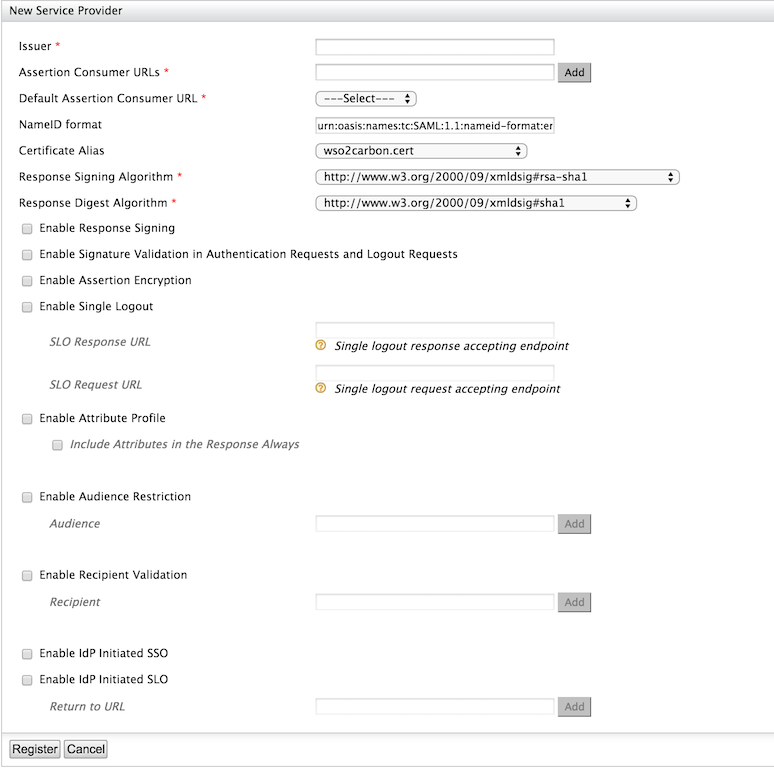

# Logging in to WSO2 Products via the Identity Server

When using multiple products of the WSO2 in a deployment, you need to
log in to the management console of each and every product. This can be
an overhead and a waste of time. Hence, it is useful to configure single
sign-on for all the WSO2 products in the deployment and obtain access to
all by providing credentials only once.

**Applies to:**

-   [WSO2 Identity Server](http://wso2.com/products/identity-server)
    (4.0.0 onwards)
-   [WSO2 Enterprise Service Bus](https://wso2.com/products/enterprise-service-bus) (4.5.1
    onwards)
-   [WSO2 API Manager](https://wso2.com/api-management/) (1.4.0 onwards)

By default, all WSO2 servers start in the HTTPS port 9443 and HTTP port
9763. Therefore, when you run multiple WSO2 servers you must change the
default ports so that there would be no port conflicts. So you must do
the following port allocations for this scenario:

-   IS runs in https port 9443 (default)
-   ESB runs in https port 9445 (offset = 2)

By default, WSO2 servers use basic authentication for authentication.
However, in a Single-Sign-On (SSO) environment, you must use SAML-based
authentication to authenticate users to WSO2 servers. The following
needs to be done in order to enable SSO:

!!! note "Before you begin"
	For single sign-on to work, you need to configure the WSO2 products to
	share a common user store. For more information on configuring this, see
	[Configuring the Primary UserStore](../../setup/configuring-the-primary-user-store).

## Configuring WSO2 Enterprise Service Bus

Configure the port and the authenticator of the WSO2 Enterprise Service Bus.

### Port configuration

1.  Download the WSO2 ESB from
    [here](https://wso2.com/products/enterprise-service-bus) and extract
    it. This unzipped folder is referred to as
    `            <ESB_HOME>           ` in this topic.
2.  Open the
    `            <ESB_HOME>/repository/conf/carbon.xml           ` file
    and change the port offset to `            2           ` .

### Authenticators configuration

1.  Enable the `            SAML2SSOAuthenticator           ` in the
    `            <ESB_HOME>/repository/conf/security/authenticators.xml           `
    file.
2.  Change the `             ServiceProviderID            ` . This ID is
    used by the Identity Server to identify the ESB's requests. Change
    this value to `             carbonServer2            ` .  
    

    !!! info "Additional Configuration"
		When the cluster is hosted on the cloud or on a remote server, the
		`              IdentityProviderSSOServiceURL             ` tag must
		be changed in the
		`              <IS_HOME>/repository/conf/deployment.toml             `
		file. This should point to the host URL of the load balancer of the
		cluster. This is done because the authentication is done by the WSO2
		Identity Server cluster and the load balancer will decide where the
		authentication request is sent to.

		From WSO2 Identity Server 5.0.0 onwards, there are different SAML
		endpoints for each tenant. If the service provider calls the
		identity provider's SAML endpoint URL as
		<https://is.com:9443/samlsso?tenantDomain=foo.com> or the issuer
		name is appended with @\<TenantDomain\> like
		<travelocity.com@foo.com>, the SAML requests are directed to the
		[foo.com](http://foo.com/) tenant.

		The `              VerifySignatureWithUserDomain             `
		parameter is used to make the most recent products
		switch behaviour to expect SAML responses in the previous way. I.e.,
		if this is set as `              true             ` , it means that
		the SAML response is verified with the tenant's key that the
		authenticated user belongs to. If it is set to
		`              false             ` it means that the SAML response
		is verified with the tenant's key to which the SAML request is
		directed to. This can be set in the
		`              <IS_HOME>/repository/conf/deployment.toml             `
		file.

		``` java
		[admin_console.authenticator.saml_sso_authenticator]
		VerifySignatureWithUserDomain= true
		```

## Configuring WSO2 Identity Server

1.  Download the WSO2 Identity Server from [here](http://wso2.com/products/identity-server).
2.  Extract the .zip file.
3.  Open a terminal and navigate to the
    `            <IS_HOME>/bin           ` folder.
4.  Start the Identity Server using the **wso2server.sh** file in Unix
    or **wso2server.bat** file in Windows.
5.  Once the server is started, visit the following URL:
    `                         https://localhost:9443/carbon/                       `
6.  Sign in to the WSO2 Identity Server. Enter your username and
    password to log on to the [Management
    Console](../../setup/getting-started-with-the-management-console)
    .
7.  Navigate to the **Main** menu to access the **Identity** menu. Click
    **Add** under **Service Providers**.  
    
    
8.  Fill in the **Service Provider Name** and provide a brief
    **Description** of the service provider in the resulting screen. If
    the service provider configuration is used by tenants as well, you
    must select the **SaaS Application** checkbox.

    !!! tip 
		By default, the **SaaS Application** checkbox is disabled,
		which means the web application is not shared among tenants so only
		users in the current tenant (the one you use to define the service
		provider) will be allowed to log into the web
		application. Alternatively, if you enabled the **SaaS Application**
		checkbox, that means this web application is shared among tenants so
		users from any tenant will be allowed to log into the web
		application. For example, if there are three tenants, namely TA, TB
		and TC and the service provider is registered and configured only in
		TA.

		-   If the **SaaS Application** configuration is disabled, only
			users in TA are able to log into the web application.

		-   If the **SaaS Application** configuration is enabled, all TA,
			TB, TC users are able to log into the web application.

9.  Expand the **SAML2 Web SSO Configuration** under **Inbound
    Authentication Configuration**.  
    
    
10. Click **Configure** . Fill in the form that appears.  
    
    
11. Fill up this page with the following configurations. 

    1.  Use the following values to register the WSO2 ESB:

        Issuer : carbonServer2

        Assertion Consumer URL : <https://localhost:9445/acs>

        Use fully qualified username in the NameID

        Enable Response Signing

        Enable Assertion Signing

        Enable Single Logout

    2.  Make a note of the following when you are using tenant
        configurations. This can be done in all the WSO2 Carbon servers.

        !!! note "Additional configurations"
			If you need to sign the SAML response using an authenticated
			user's tenant keystore, please add the following configuration.
			(By default, the response is signed using the certificate that
			belongs to the tenant where the service provider is registered).
			This property must be added if the SAML authenticator version in
			the WSO2 Carbon products that you are using is 4.2.2 or higher (
			`                 org.wso2.carbon.identity.authenticator.saml2.sso_4.2.2.jar                `
			).

			Add the
			`                 enable_user_domain_crpto               `
			property available in the
			`                 <IS_HOME>/repository/conf/deployment.toml                `
			file as shown below.
			
			```xml
			[saml] 
			enable_user_domain_crpto= true
			```
			
			The above configuration is an alternative to the
			`                 VerifySignatureWithUserDomain                `
			property in the
			`                 <IS_HOME>/repository/conf/deployment.toml                `
			file.

12. Under the **Local & Outbound Authentication Configuration** you can
    configure different authentication mechanisms you like to enforce.
    For example you can configure a authentication chain and enable
    Multi-factor authentication for WSO2 Products.  
    

13. Click **Register** to save the values and register each service
    provider created.

## Configuring WSO2 API Manager

For more information on configuring IS as the identity provider in WSO2
API Manager, see [Configuring Identity Server as IDP for
SSO](https://docs.wso2.com/display/AM260/Configuring+Identity+Server+as+IDP+for+SSO).