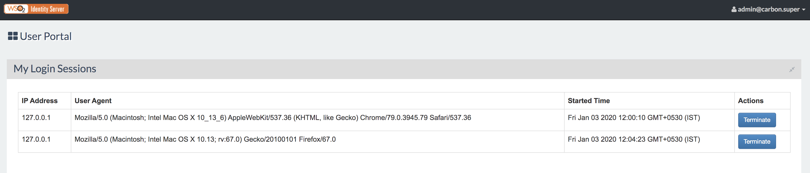

# Using the End User Dashboard

The WSO2 Identity Server dashboard for end users provides a means to
manage the user profile or the user account, add security questions,
revoke/update the password, manage user profile, and view identity
providers. This is also known as account self-service. This topic
includes the following tasks which can be done using the dashboard.

!!! warning
    
    Hostname verification may prevent loading the Dashboard. For
    instructions on how to disable hostname verification, see [Enabling
    HostName
    Verification](../../administer/enabling-hostname-verification)
    .
    

### Accessing the dashboard and its components

1.  Go to the dashboard URL: <https://localhost:9443/dashboard/>
2.  Enter your username and password and click the **Sign In** button.
3.  The dashboard appears.  
     
4.  Click the **View details** button to access the components.
5.  Click the drop-down at the top right corner of the screen to sign
    out.

### Editing your profile

To edit your profile, do the following.

1.  [Access the dashboard](#accessing-the-dashboard-and-its-components).
2.  Once you have logged in, click **View details** under **My Profile**
    .
3.  In the resulting screen, populate the fields with your personal
    information.  

     

    ??? note "Click here to know more about the fields in the form"
        |              |                                                      |
        |--------------|------------------------------------------------------|
        | First Name   | Your first name.                                     |
        | Last Name    | Your last name.                                      |
        | Organization | The organization you work in.                        |
        | Country      | The name of the country you live in/work in.         |
        | Email        | Your email address.                                  |
        | Telephone    | Your local/organization contact number.              |
        | Mobile       | Your mobile number.                                  |
        | IM           | Your instant messaging number.                       |
        | URL          | Your website/organization website's URL.             |
        | Department   | The department you work in within your organization. |
        | Role         | The role you have been assigned to.                  |

    !!! tip
    
        For information on managing U2F authentication for multi-factor
        authentication, see [Universal Second Factor (U2F) Authentication](../../learn/multi-factor-authentication-using-fido#universal-second-factor-(u2f))).
    

4.  Click **Update** to save your changes.

### Exporting personal information

To export the user's personal information, do the following.

1.  [Access the dashboard](#accessing-the-dashboard-and-its-components).
2.  Once you have logged in, click **View details** under **My
    Profile.**
3.  Click **Export**. A `           userInfo.json          ` file
    containing the JSON representation of the user information on your
    profile will be downloaded onto your machine.

    !!! tip
    
        The consent receipts in the
        `           userInfo.json          ` file contain the PII controller
        information as it is at the time that the receipt is generated. If
        the PII controller has changed after the receipt was generated, this
        change will not be reflected in the existing receipts. To get an
        updated consent receipt that reflects the change, generate a new
        consent receipt by doing one of the following:
    
        1.  [Revoke the
            consent](#configuring-consent-for-services)
            via the dashboard and go through the flow that prompts the
            relevant consent again (e.g., revoke the given consent for the
            WSO2 IS dashboard, log out, then log back in and approve consent
            again. A new consent receipt will be generated for the WSO2 IS
            dashboard consent).
        2.  Use the [Consent Management REST APIs](../../develop/using-the-consent-management-rest-apis) to revoke the
            existing consent and add a new consent.
    

     

    !!! tip
    
        For information on the Personal Information Export REST APIs, see the [Personal Information Export API Swagger documentation](develop/using-the-personal-information-export-rest-apis/).
    

### Updating your account recovery details

To update the details pertaining to recovering your account, do the
following.

1.  [Access the dashboard](#accessing-the-dashboard-and-its-components).
2.  Once you have logged in, click **View details** under **Account
    Recovery**.
3.  Set the challenge question from the drop-down and enter an answer
    for the question you choose.  
     
4.  Click **Update** to save your changes.

See [Password Recovery](../../learn/password-recovery) for more information on how
this works.

### Changing your password

To change your password, do the following.

1.  [Access the dashboard](#accessing-the-dashboard-and-its-components).
2.  Once you have logged in, click **View details** under **Change
    Password**.
3.  In the resulting screen, enter your **Current Password**, fill in
    the **New Password** and confirm it by filling out the **Confirm New
    Password** field.  
     
4.  Click **Update** to save your changes.

### Connecting your social identity with your account

To connect your social identity login credentials with your WSO2
Identity Server account, do the following.

1.  [Access the dashboard](#accessing-the-dashboard-and-its-components).
2.  Once you have logged in, click **View details** under **Associated
    Accounts**. The list of social identities linked to your account
    appear.

See [Associating User Accounts](../../learn/associating-user-accounts) for more
information on using this section of the dashboard.

### Working with your authorized applications

To access and manage the OAuth-based authorized applications for your
account, do the following.

1.  [Access the dashboard](#accessing-the-dashboard-and-its-components).
2.  Once you have logged in, click **View details** under **Authorized
    Apps**. A list of available authorized apps appears.
3.  Click **Remove Application** if you wish to disassociate the
    application from your account.

### Dealing with pending approvals

To access and manage the pending approvals for your account, do the
following.

1.  [Access the dashboard](#accessing-the-dashboard-and-its-components).
2.  Once you have logged in, click **View details** under **Pending
    Approvals**. The following page appears, listing out the pending
    account approval requests.
3.  Select the requests you want to approve. Click on the relevant
    **Task Id** to access the details of the selected task and click on
    the button corresponding to a state to move the state of the
    selected task to a new state and to complete the workflow approval
    process (e.g., clicking **Start** and then **Approve** will approve
    the pending task and complete the workflow process).  
     

See [Workflow Management](../../learn/workflow-management) for more information on
how this works.

### Configuring consent for services

!!! info "About Consent Receipt"

    "A *consent receipt* is a record of consent provided to an individual at
    the point when a person agrees to the share of personal information.
     Its purpose is to capture the privacy policy and its purpose for
    sharing personal information so it can be easily used by people to
    communicate and manage consent and sharing of personal information once
    it is provided. For more information, see the [Consent Receipt
    Specification](https://kantarainitiative.org/confluence/display/infosharing/Consent+Receipt+Specification)
    .

The user dashboard provides you a list of all the active consent
receipts that have already been approved. It also gives the ability to
update/revoke the consents approved to be consumed by services provided
via WSO2 Identity Server. Follow the steps below to configure this.

1.  [Access the dashboard](#accessing-the-dashboard-and-its-components).
2.  Once you have logged in, click **View details** under **Consent
    Management**.

     

3.  You will see a list of consent receipts that you have already
    approved to be consumed by services. The consent receipts listed
    here are records of provided consent for consumption of personal
    information, which you are prompted to provide during the self
    registration or SSO login flow.

    !!! note
    
        **System consent** is consent for personal information used by the
        resident identity provider in WSO2 Identity Server. Consents for
        other applications are listed below the system consent. These are
        consents collected during authentication using single sign on or
        during self registration.
    

     

New users can do the following actions from this screen:

!!! note
    Existing users (users who are already onboarded) will also see the
     icon and can configure consent
    accordingly but will not see the **Revoke** button to revoke consent for
    all attributes.
    

-   **Revoke consent for all attributes** - Click **Revoke** to revoke
    consent for all consented attributes.

-   **Revoke consent for specific attributes** - Click the
     icon.  You can see the
    detailed view of the consent receipt. It contains brief information
    about the service and shows the consented attributes for this
    service. Deselect claims accordingly to revoke consent. Click
    **Update**.

    !!! tip "Accepting consent for new attributes"
   
        -   For system consent, users can consent to newly added attributes
            by selecting the new claims that appear on this screen. 
        
         
    
        -   For consents in other applications (other than the system
            consent), the user will be prompted to provide consent for newly
            added **mandatory** attributes during the [SSO
            flow](../../learn/consent-management-with-single-sign-on).
    
        -   To **accept** consent for any optional attributes, revoke the
            whole consent receipt and provide consent again at the point of
            authentication. For more information, see [Consent Management
            with Single-Sign-On](../../learn/consent-management-with-single-sign-on).
    

-   **Set an expiration date for consent** - Click the
     icon and set an expiry date
    for a particular consent by selecting a value from the date picker
      shown in the
    consent detail page. When an expiry date is selected, the consent
    will only be valid until the specified date. Once the consent
    expires, the details gathered are set to a 'revoked' state. At the
    point of authentication, the user is prompted again to provide
    consent for any mandatory attributes that the service requires.
    However, the user is not prompted to give consent for non mandatory
    attributes and the corresponding service will not be able to receive
    those attributes in new authentication requests.  
     

### Terminating user sessions

To view the active sessions, click **View Details** under **My Login Sessions**. 

Following are the details of the active sessions that can be found in **My login Sessions**.

| Fields       |            Descriptions                              |
|--------------|------------------------------------------------------|
| IP Address   | The IP address of the device the session is active on.|
| User Agent   | The device, browser, and OS in which the session is active.|
| Started Time | The time at which the session was activated.|

To terminate an active session, click the corresponding **Terminate** button.

Click **Yes** in the pop up that appears next to proceed with the termination. 

You have successfully revoked your session! 
 

