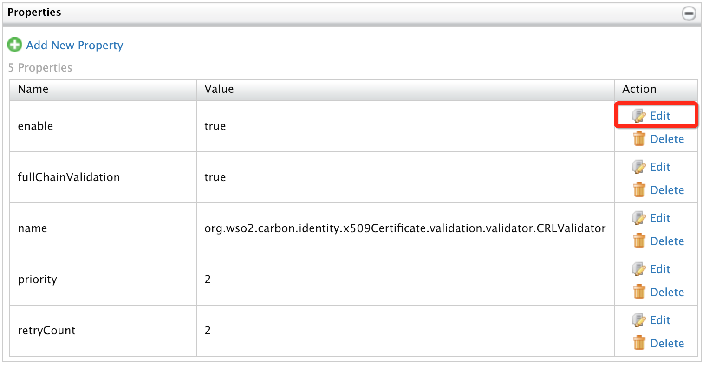
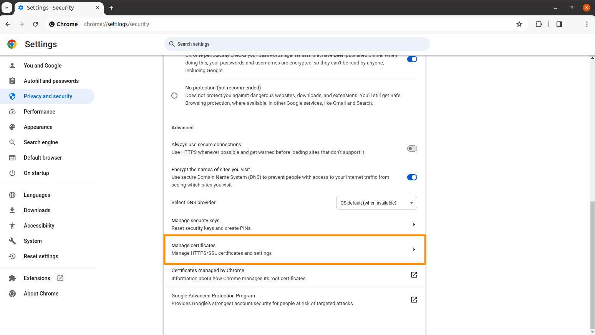
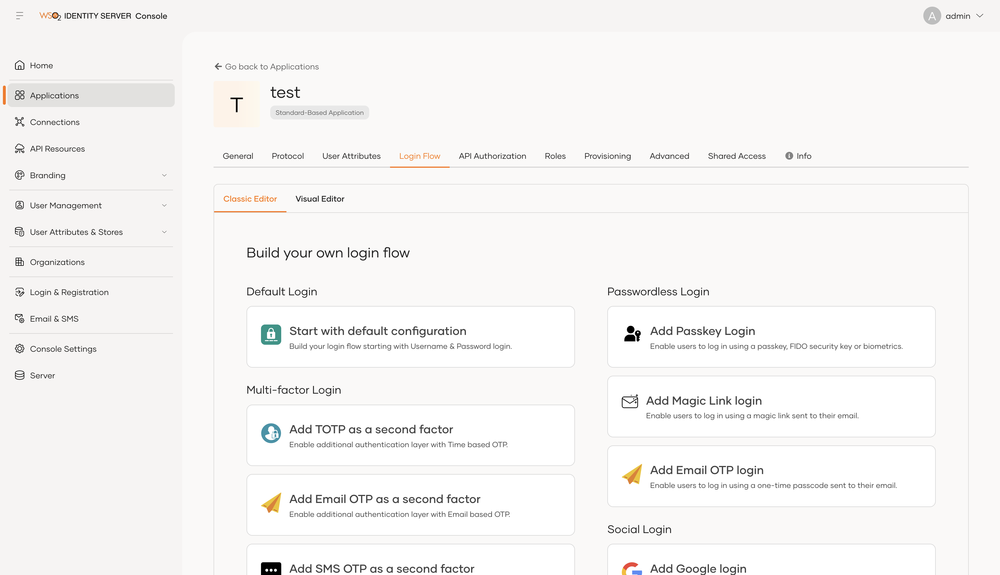
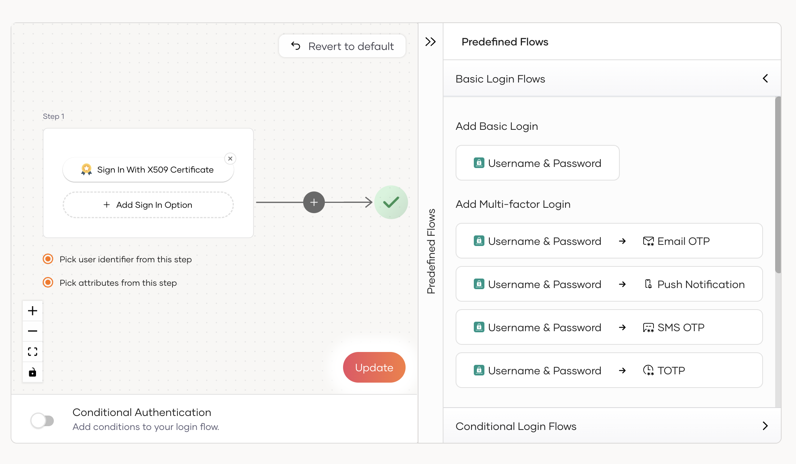

# Configure X509 Certificate Authenticator

This page guides you through configuring the X509 certificate authenticator with {{ product_name }}.

!!!note
    You need to create the necessary certificates and truststores before you start configuring the x509 
    authenticator on {{ product_name }}.

X509 authentication requires the client to possess a Public Key Certificate (PKC). To create a sample certificate 
and create your own Certificate Authority to sign the certificates, follow the give steps below: 

1. Create the private RSA key using the following command.

    ``` shell
    openssl genrsa -out rootCA.key 2048
    ```
    For this example, we have used the key size as `2048`, you can specify the key size as you wish.

2. Based on this key you can now generate an actual certificate which is valid for 10 years using the following command:

    ```
    openssl req -new -x509 -days 3650 -key rootCA.key -out rootCA.crt
    ```

3. You are prompted to provide the following details, and the details you provide are incorporated into the 
    certificate request. An example is given below.

    ```text
    - Country Name (2 letter code) [AU]: SL
    - State or Province Name (full name) [Some-State]: Western
    - Locality Name (eg, city) [ ]: Colombo
    - Organization Name (eg, company) [Internet Widgits Pty Ltd]: WSO2
    - Organizational Unit Name (eg, section) [ ]: QA
    - Common Name (e.g. serverFQDN or YOUR name) [ ]: wso2is.com
    - Email Address [ ]: kim@wso2.com
    ```

4. An OpenSSL CA requires new files and supporting directories. Therefore, create a new directory.
    Create the directory structure according to your `openssl.conf` format.

    ``` shell
    mkdir -p demoCA/newcerts
    ```
    
5. You also need some initial files inside your CA directory structure.
    
    ``` shell
    touch demoCA/index.txt
    echo '01' > demoCA/serial
    ```

6. For the JVM to trust your certificate, import your certificate into your JVM truststore. 
    You can use the following command by updating the values for `<path_to_the_jvm_truststore>` and `<password_of_the_truststore>`.

    ``` shell
    keytool -import -noprompt -trustcacerts -alias rootCA -file rootCA.crt -keystore <path_to_the_jvm_keystore> -storepass <password_of_the_keystore>
    ```

    !!! info "Got the 'permission denied' error?"
        Note that when adding the certificate to the JVM trust store you may get the permission denied error. Running this command as an 
        administrator resolves this permission issue.
        
        For example, if you are a Mac user, you can use sudo in front of this command to fix the permission issue.  

7. Create the server certificate. To create the server certificate, follow the steps give below:

    1. Create the keystore that includes the private key by executing the following command:

        ``` shell
        keytool -genkey -v -alias localcrt -keyalg RSA -validity 3650 -keystore localcrt.jks -storepass localpwd -keypass localpwd
        ```

        You will be prompted to enter the following details before creating the keystore.

        !!! tip
            You are prompted for details after executing the above command. For "What is your first and last name?" 
            you need to give a name without space(e.g., wso2). 

        This command will create a keystore with the following details: 

        ``` text
        - Keystore name: localcrt.jks
        - Alias of public certificate: localcrt
        - Keystore password: localpwd
        - Private key password: localpwd (this is required to be the same as keystore password)
        ```

    2. Execute the following command to generate the certificate signing request(CSR) using the generated keystore file.

        ``` shell
        keytool -certreq -alias localcrt -file localcrt.csr -keystore localcrt.jks -storepass localpwd
        ```

    3. To enable CRL or OCSP based certificate revocation validation, configure the necessary openSSL extension configurations.
        
        1.  Open either of the following files.
            -  `validation.cnf`
            -  `/usr/lib/ssl/openssl.cnf`

        2.  Set the following properties under `x509\_extensions`.

            ``` java
            crlDistributionPoints = URI:http://pki.google.com/GIAG2.crl
            authorityInfoAccess = OCSP;URI: http://clients1.google.com/ocsp
            ```
    
    4. Once it is done, sign the CSR, which requires the CA root key.

        ``` shell
        openssl ca -batch -startdate 150813080000Z -enddate 250813090000Z -keyfile rootCA2.key -cert rootCA2.crt -policy 
        policy_anything -config {File_Path}/openssl.cnf -notext -out localcrt.crt -infiles localcrt.csr
        ```

        This creates a signed certificate called `localcrt.crt` that is valid for a specified period that is denoted by the `startdate` and `enddate`.

    5. The next step is to import the CA and signed certificate into the keystore.

        ``` shell
        keytool -importcert -alias rootCA -file rootCA.crt -keystore localcrt.jks -storepass localpwd -noprompt
        
        keytool -importcert -alias localcrt -file demoCA/newcerts/01.pem -keystore localcrt.jks -storepass localpwd -noprompt
        ```
    
    6. Now, get the `pkcs12` out of `.crt` file using the command given below as it is been used to import certificates to the browser.

        ``` shell
        keytool -importkeystore -srckeystore localcrt.jks -destkeystore localhost.p12 -srcstoretype JKS -deststoretype PKCS12 -srcstorepass 
        localpwd -deststorepass browserpwd -srcalias localcrt -destalias browserKey -srckeypass localpwd -destkeypass browserpwd -noprompt
        ```

        Make sure to use the same password you used when creating the keystore for the `srcstorepass` in the above step. Now you have 
        the `localhost.p12` file that you can import into your browser as explained in the [import certificate](#import-certificate) section.

    7. Next, create a new trust store and import the server certificate into the trust store using the following commands:

        ``` shell
        keytool -import -keystore cacerts.jks -storepass cacertspassword -alias rootCA -file rootCA.crt -noprompt
        keytool -importcert -alias localcrt -file localcrt.crt -keystore cacerts.jks -storepass cacertspassword -noprompt
        ```
        !!! tip "CN"
            The User objects in the LDAP directory hierarchy have designators that start with CN, meaning Common Name. The CN designator 
            applies to all but a few object types. Active Directory only uses two other object designators (although LDAP defines several).

Once you have done the above steps, you have the keystore (`localcrt.jks`), truststore (`cacerts.jks`), and pkcs12 (`localhost.p12`) files 
that you need to use later on in this guide.

## Configure the X509 certificate for the app

1.  Download [{{ product_name }}](http://wso2.com/products/identity-server/).

2.  Replace your keystore file path, keystore password, trust store file path and trust store password (you can use the keystore and
    truststore, which you created in the [Work with Certificates](#work-with-certificates) section) in the following configuration and add it to the
    `<IS_HOME>/repository/conf/deployment.toml` file.

    ``` toml 
    [custom_transport.x509.properties]
    protocols="HTTP/1.1"
    port="8443"
    maxThreads="200"
    scheme="https"
    secure=true
    SSLEnabled=true
    keystoreFile="/path/to/keystore.jks"
    keystorePass="keystorepwd"
    truststoreFile="/path/to/truststore.jks"
    truststorePass="truststorespassword"
    bindOnInit=false
    clientAuth="want"
    ssl_protocol = "TLS"
    ```

    !!! note
    
        1.   To function properly, this connector should come first in the order. Otherwise, when mutual SSL takes place, the already existing connector (9443) will be picked up and the certificate will not be retrieved correctly.

        2.  The `clientAuth` attribute causes the Tomcat to require the client with providing a certificate that can be configured as follows.
            -   `true` : valid client certificate required for a connection to succeed
            -   `want` : use a certificate if available, but still connect if no certificate is available
            -   `false` : no client certificate is required or validated
    
        3.   The `truststoreFile` attributes specifies the location of the truststore that contains the trusted certificate issuers.

## Disable certificate validation

The location that is used to disable certificate validation depends on whether {{ product_name }} was started at least once or not.

-   If you have never started {{ product_name }} before, the configurations should be made on the `deployment.toml` file.

-   If you have started {{ product_name }} at least once, the configurations should be made on the registry parameters.

### Disable certificate validation in an unstarted {{ product_name }} pack

Follow the steps below to disable certificate validation if your {{ product_name }} pack has never been started.

1.  Open the `deployment.toml` file in the `<IS_HOME>/repository/conf` directory.

2.  Add the following configuration to disable CRL-based certificate validation and OCSP-based certificate validation.

    ``` toml
    [certificate_validation]
    ocsp_validator_enabled = false
    crl_validator_enabled = false
    ```
    
    !!! infox
        - CRL is a list of digital certificates that have been revoked by the issuing CA.
        - OCSP is an internet protocol that is used for obtaining the revocation status of an X509 digital certificate using the certificate serial number.

### Disable certificate validation in an already-started {{ product_name }} pack

Follow the steps below to disable certificate validation if {{ product_name }} was started before.

1. Log in to the {{ product_name }} Management Console (`https://<IS_HOST>:<PORT>/carbon`) using administrator credentials (`admin:admin`).

2.  Click **Main > Registry > Browse**.  
    {: width="300" height="500" style="display: block; margin: 0; border: 0.3px solid lightgrey;"}

3.  Disable CRL certificate validation.

    1.  Locate the CRL parameter by entering
            `_system/governance/repository/security/certificate/validator/crlvalidator`
            in the **Location** search box.  
            {: width="600" style="display: block; margin: 0; border: 0.3px solid lightgrey;"}

    2.  Expand **Properties**.  
        {: width="600" style="display: block; margin: 0; border: 0.3px solid lightgrey;"}
    
    3.  Click **Edit** pertaining to the **Enable** property.  
        {: width="600" style="display: block; margin: 0; border: 0.3px solid lightgrey;"}

    4. Change the value to `false`, click **Save**.  
        {: width="600" style="display: block; margin: 0; border: 0.3px solid lightgrey;"}

    5. Similarly, disable OCSP certificate validation in the `_system/governance/repository/security/certificate/validator/ocspvalidator`
        registry parameter.

## Configure the Authentication Endpoint

1.  Open the `deployment.toml` file in the `<IS_HOME>/repository/conf/` directory.

2.  Add the following configuration to the file.

    ``` toml
    [authentication.authenticator.x509_certificate.parameters]
    name ="x509CertificateAuthenticator"
    enable=true
    AuthenticationEndpoint="https://localhost:8443/x509-certificate-servlet"
    username= "CN"
    ```

    !!! info
        - `name` : This attribute identifies the authenticator that is configured as the second authentication step. 
        - `enable`: This attribute, when set to true makes the authenticator capable of being involved in the authentication process. 
        - `AuthenticationEndpoint` : This is the URL with the port that is secured with the certificate, 
            e.g., `https://localhost:8443/x509-certificate-servlet`. 
            This value will be taken to extract the certificate from the browser by redirecting the user to the specified endpoint. 
            Update this based on your host name.
        - `username` : This attribute value will be taken as the authenticated user subject identifier. Update this
             with any of the certificate attributes, e.g., CN and Email.

    !!! note
        When X509 authentication is configured as the second authentication
        step, the certificate will be validated to check whether it is
        associated with the authenticated user in the first authentication
        step. For that, the `username` parameter will
        be used. For that, the authenticated user name considered in the
        first authentication step will be validated with the certificate
        attribute in this property.
    
        When X509 authentication is configured as the first step, this
        certificate attribute will be treated as the authenticated user
        subject identifier.
    
3.  If you are using a user property to store X509 certificate, add the following parameter.

    ``` toml
    [authentication.authenticator.x509_certificate.parameters]
    setClaimURI = "http://wso2.org/claims/userCertificate"
    ```

4.  To enable storing the X509 certificate as a user claim, add the following parameter.

    ``` toml 
    [authentication.authenticator.x509_certificate.parameters]
    EnforceSelfRegistration = true
    ```

5. Restart the server to apply the changes.

## Add a claim mapping for the certificate

If storing the certificate as a user claim is enabled, the X509 certificate will be stored as a user claim and verified with the
retrieved certificate from the request.

To add the custom attribute, follow the [Add custom attributes](../../../guides/users/attributes/manage-attributes.md/#add-custom-attributes) steps 
and use the following details for the claim addition.

``` text
- Attribute name : userCertificate
- Attribute Display Name : User Certificate
```
{: width="600" style="display: block; border: 0.3px solid lightgrey;"}

This will create the **OpenID Connect** and **SCIM 2.0** protocol mappings as well. When storing the certificate in a user attribute, you will 
need to update the column size of the `VALUE` column of the `UM_USER_ATTRIBUTES` table to a suitable value.

## Import certificate

-   **Chrome**
    1.  In your browser, go to **Settings** > **Privacy and security** > **Manage certificates** > **Your certificates**.
    
        {: width="800" style="display: block; margin: 0; border: 0.3px solid lightgrey;"}

    2.  Click on **Import,** select the **localhost.p12** file, and then
    click **Open**. Note that you may have to enter the password that
    you used to generate the p12 file, (browserpwd) to open it.
    
        {: width="800" style="display: block; margin: 0; border: 0.3px solid lightgrey;"}

-   **Firefox**
    1.  Click on the menu option on the right of the screen and select
        **Settings**.  
    
        {: width="300" height="500" style="display: block; margin: 0; border: 0.3px solid lightgrey;"}

    2.  Click **Privacy & Security** in the left navigation and scroll down to
        the **Certificates** section. Click **View Certificates**.  
        
        {: width="800" style="display: block; margin: 0; border: 0.3px solid lightgrey;"}

    3.  Go to **Your Certificates** in the window that appears, click **Import**.  

        {: width="600" style="display: block; margin: 0; border: 0.3px solid lightgrey;"}

    4.  Select the **localhost.p12** file, and then click **Open**. Note
        that you may have to enter the password that you used to generate
        the p12 file, (browserpwd) to open it.

## Register an app

The next step is to configure the application.

1. Go to Console and create an application by following the steps in [Web applications](../../../guides/applications/index.md#web-applications)

2. Go to **Login Flow** of the created app, select **Start with default configuration** option.

    {: width="800" style="display: block; margin: 0; border: 0.3px solid lightgrey;"}

3. Remove the default **Username & Password** authenticator, add **X509 Certificate** and **Update**.

    {: width="800" style="display: block; margin: 0; border: 0.3px solid lightgrey;"}

4. Finally, click on **Update** to finish the application configurations.

## Onboard a user

A user for the corresponding certificate should be available in the system to perform the authentication. Follow the given instructions 
in [Onboard single user](../../users/manage-users.md/#onboard-single-user) to onboard a user with the username `wso2is.com` (This is the CN of the created certificate above).

## Try it out

Try to login to the application you have configured. You will be prompted to send the certificate.

{: width="600" style="display: block; margin: 0; border: 0.3px solid lightgrey;"}

Once the authentication is successful, you will be redirected to the configured callback location of the application.
