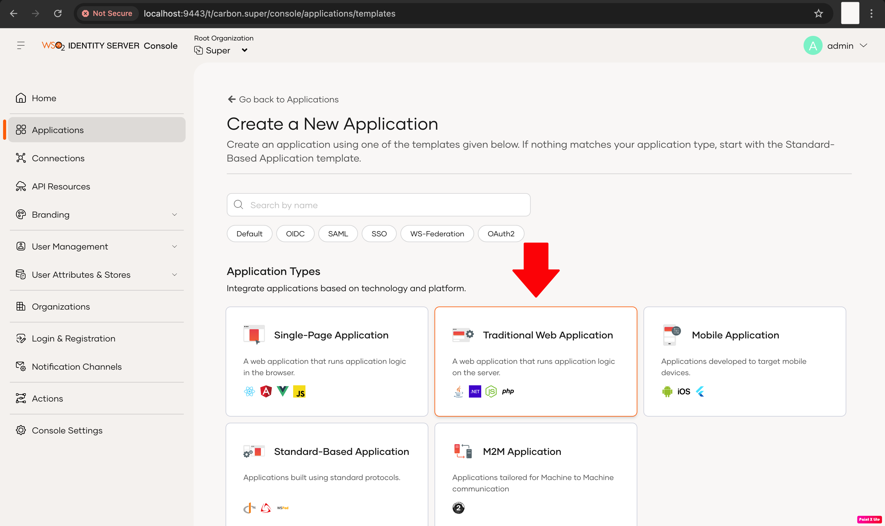

# ORY Oathkeeper - Customized for OIDC Authentication Setup Guide

## Overview

This customized Oathkeeper setup functions as an identity-aware reverse proxy or an identity gateway. It authenticates incoming requests via WSO2 Identity Server (or any other identity provider), establishes a secure session by storing a session for each authenticated user, and forwards the request to the backend service. For authenticated users, it injects authentication details (such as tokens and user information) into HTTP headers before proxying the request. Upon receiving a response from the backend, Oathkeeper captures it, attaches the necessary cookies, and then sends the complete response back to the client.

## Prerequisites

- Go 1.16 or later
- Redis server (for session storage)
  - Default port: 6379
  - Optional: Set a password for production use
- OIDC-compliant Identity Provider (e.g., WSO2 Identity Server 7.0.0 or later)
- Access to your backend application

## Installation Steps

### Step 1: Install and Start WSO2 Identity Server

**Quick Setup Guide for WSO2 IS 7.0.0**

1. **Download WSO2 IS**
   Download the latest version of WSO2 Identity Server from: https://wso2.com/identity-and-access-management/

2. **Extract the Archive**
   Unzip the downloaded file:
   ```bash
   unzip wso2is-<version>.zip
   ```
   Note: Replace `<version>` with your downloaded version, e.g., `wso2is-7.0.0`.

3. **Start the Server**
   Navigate to the bin directory:
   ```bash
   cd path/to/wso2is-<version>/bin
   ```
   Then run:
   ```bash
   ./wso2server.sh    # On Linux/macOS
   wso2server.bat     # On Windows
   ```

4. **Create an OIDC Application**
   - Go to [https://localhost:9443/console](https://localhost:9443/console)
   - Login (default: `admin` / `admin`)
   - Navigate to **Applications → Add Application**
   
   - Select **Traditional Web Application**
     
   - Fill in:
     - **Name:** `oathkeeper-app`
     - **Callback URL:** `http://localhost:4556/oauth2/callback` (or your proxy callback URL)
       
   - Save and copy the generated **Client ID** and **Client Secret**
     

### Step 2: Set Up Your Backend

If you don't already have a backend implemented, you can download our sample application from [here] for testing. Once downloaded, run the app:

```bash
cd path/to/app/folder
java -jar request-logger-Sample application.jar
```

Make sure it's working by visiting:
```
http://localhost:8080
```

If the page loads successfully, your backend is up and running.

### Step 3: Configure Oathkeeper

1. **Create and navigate to a new directory:**
   ```bash
   mkdir oathkeeper-demo
   cd oathkeeper-demo
   ```

2. **Fork the repository:**
   git clone --branch v0.40.9 --single-branch https://github.com/ory/oathkeeper.git
   
   Clone it:
   ```bash
   git clone https://github.com/<your-github-username>/oathkeeper.git
   cd oathkeeper
   ```

3. **Download all the files from <link>**

   Replace following folders and files:
   
   **Folders:**
   - root/proxy
   - root/pipeline/errors
   
   **Files:**
   - root/driver/configuration/provider_koanf.go
   - root/driver/configuration/provider.go
   - root/driver/registry_memory.go
   - root/rule/rule.go

   **Add the below authenticator files in:**
   - root/pipeline/authn
     - authenticator_callback.go
     - authenticator_callback_test.go
     - authenticator_session_jwt.go
     - Authenticator_session_jwt_test.go

   **Add session store folder to:**
   - root/pipeline

   **Add the following config schemas to:**
   - root/pipeline/spec
     - Authenticators.callback.schema.json
     - Authenticators.session_jwt.schema.json
     - Errors.redirect.schema.json
     - Session_store.schema.json

   **And in root/config.schema.json**

   Add the below configurations:

   ```json
   {
     "definitions": {
       "configErrorsRedirect": {
         "type": "object",
         "title": "HTTP Redirect Error Handler",
         "description": "This section is optional when the error handler is disabled.",
         "additionalProperties": false,
         "required": ["to"],
         "properties": {
           "type": {
             "title": "Redirect Type",
             "description": "Defines the type of redirect: 'auth' for authentication with CSRF protection, 'logout' for logout flows, or 'none' for simple redirects.",
             "type": "string",
             "enum": ["auth", "logout", "none"],
             "default": "none"
           },
           "oidc_logout_url": {
             "type": "string",
             "format": "uri",
             "description": "The URL to redirect to after logout.",
             "examples": ["https://my-app.com/logout"]
           },
           "post_logout_redirect_url": {
             "type": "string",
             "format": "uri",
             "description": "The URL to redirect to after logout.",
             "examples": ["https://my-app.com/after-logout"]
           },
           "to": {
             "title": "Redirect to",
             "description": "Set the redirect target. Can either be a http/https URL, or a relative URL.",
             "type": "string",
             "format": "uri-reference",
             "examples": [
               "http://my-app.com/dashboard",
               "https://my-app.com/dashboard",
               "/dashboard"
             ]
           },
           "code": {
             "title": "HTTP Redirect Status Code",
             "description": "Defines the HTTP Redirect status code which can be 301 (Moved Permanently) or 302 (Found).",
             "type": "integer",
             "enum": [301, 302],
             "default": 302
           },
           "return_to_query_param": {
             "title": "URL query parameter",
             "description": "Adds the original URL the request tried to access to the query parameter.",
             "type": "string",
             "pattern": "^[A-Za-z0-9,._~-]*$",
             "default": ""
           },
           "oidc_authorization_url": {
             "type": "string",
             "format": "uri",
             "description": "OIDC authorization endpoint URL",
             "examples": ["https://your-oidc-provider.com/oauth2/auth"]
           },
           "client_id": {
             "type": "string",
             "description": "OIDC client identifier"
           },
           "redirect_url": {
             "type": "string",
             "format": "uri",
             "description": "OIDC callback redirect URL"
           },
           "scopes": {
             "type": "array",
             "items": {
               "type": "string"
             }
           },
           "use_pkce": {
             "type": "boolean",
             "title": "Use PKCE",
             "description": "Enables PKCE (Proof Key for Code Exchange) for enhanced security in the OAuth 2.0 authorization code flow.",
             "default": false
           },
           "when": {
             "$ref": "#/definitions/configErrorsWhen"
           }
         }
       },
       "configAuthenticatorsSessionJwt": {
         "type": "object",
         "title": "JWT Authenticator Configuration",
         "description": "This section is optional when the authenticator is disabled.",
         "required": ["jwks_urls"],
         "properties": {
           "required_scope": {
             "type": "array",
             "title": "Required Token Scope",
             "description": "An array of OAuth 2.0 scopes that are required when accessing an endpoint protected by this handler.\n If the token used in the Authorization header did not request that specific scope, the request is denied.",
             "items": {
               "type": "string"
             }
           },
           "target_audience": {
             "title": "Intended Audience",
             "type": "array",
             "description": "An array of audiences that are required when accessing an endpoint protected by this handler.\n If the token used in the Authorization header is not intended for any of the requested audiences, the request is denied.",
             "items": {
               "type": "string"
             }
           },
           "trusted_issuers": {
             "type": "array",
             "items": {
               "type": "string"
             }
           },
           "allowed_algorithms": {
             "type": "array",
             "items": {
               "type": "string"
             }
           },
           "jwks_urls": {
             "title": "JSON Web Key URLs",
             "type": "array",
             "items": {
               "type": "string",
               "format": "uri"
             },
             "description": "URLs where ORY Oathkeeper can retrieve JSON Web Keys from for validating the JSON Web Token. Usually something like \"https://my-keys.com/.well-known/jwks.json\". The response of that endpoint must return a JSON Web Key Set (JWKS).\n\n>If this authenticator is enabled, this value is required.",
             "examples": [
               [
                 "https://my-website.com/.well-known/jwks.json",
                 "https://my-other-website.com/.well-known/jwks.json",
                 "file://path/to/local/jwks.json"
               ]
             ]
           },
           "jwks_max_wait": {
             "title": "Max await interval for the JWK fetch",
             "type": "string",
             "description": "The configuration which sets the max wait threshold when fetching new JWKs",
             "default": "1s",
             "examples": ["100ms", "1s"]
           },
           "jwks_ttl": {
             "title": "JWK cache TTL configuration",
             "type": "string",
             "description": "The time interval for which fetched JWKs are cached",
             "default": "30s",
             "examples": ["30m", "6h"]
           },
           "scope_strategy": {
             "$ref": "#/definitions/scopeStrategy"
           }
         },
         "additionalProperties": false
       },
       "configAuthenticatorsCallback": {
         "type": "object",
         "title": "Callback Authenticator Configuration",
         "description": "This section is optional when the authenticator is disabled.",
         "properties": {
           "client_id": {
             "type": "string",
             "title": "OAuth 2.0 Client ID",
             "description": "The OAuth 2.0 Client ID for the callback authentication.\n\n>If this authenticator is enabled, this value is required."
           },
           "client_secret": {
             "type": "string",
             "title": "OAuth 2.0 Client Secret",
             "description": "The OAuth 2.0 Client Secret for the callback authentication.\n\n>If this authenticator is enabled, this value is required."
           },
           "token_url": {
             "type": "string",
             "format": "uri",
             "title": "OAuth 2.0 Token URL",
             "description": "The OAuth 2.0 Token Endpoint URL for exchanging the authorization code.\n\n>If this authenticator is enabled, this value is required."
           },
           "userinfo_url": {
             "type": "string",
             "format": "uri",
             "title": "OAuth 2.0 Userinfo URL",
             "description": "The OAuth 2.0 Userinfo endpoint URL.\n\n>If this authenticator is enabled, this value is required."
           },
           "redirect_url": {
             "type": "string",
             "format": "uri",
             "title": "Callback Redirect URL",
             "description": "The URL where the authorization server will redirect after authorization.\n\n>If this authenticator is enabled, this value is required."
           },
           "token_endpoint_auth_method": {
             "type": "string",
             "title": "Token Endpoint Authentication Method",
             "description": "The authentication method used at the token endpoint.",
             "enum": ["client_secret_basic", "client_secret_post", "none"],
             "default": "client_secret_basic"
           },
           "preserve_host": {
             "title": "Preserve Host",
             "type": "boolean",
             "description": "When set to true the HTTP Header X-Forwarded-Host will be set to the original HTTP host.",
             "default": false
           },
           "retry": {
             "type": "object",
             "title": "Retry Configuration",
             "description": "Configuration for retrying failed requests.",
             "properties": {
               "max_wait": {
                 "type": "string",
                 "title": "Maximum Wait",
                 "description": "The maximum time to wait between retries.",
                 "pattern": "^[0-9]+(ns|us|ms|s|m|h)$",
                 "default": "1s"
               },
               "timeout": {
                 "type": "string",
                 "title": "Timeout",
                 "description": "The initial timeout for retries.",
                 "pattern": "^[0-9]+(ns|us|ms|s|m|h)$",
                 "default": "500ms"
               }
             },
             "additionalProperties": false
           },
           "cache": {
             "type": "object",
             "title": "Cache Configuration",
             "description": "Configuration for caching behavior.",
             "properties": {
               "ttl": {
                 "type": "string",
                 "title": "Time to Live",
                 "description": "The time-to-live for cached items.",
                 "pattern": "^[0-9]+(ns|us|ms|s|m|h)$",
                 "default": "5m"
               },
               "max_cost": {
                 "type": "integer",
                 "title": "Maximum Cost",
                 "description": "The maximum cost for the cache.",
                 "default": 1000
               }
             },
             "additionalProperties": false
           }
         },
         "required": [
           "client_id",
           "client_secret",
           "token_url",
           "userinfo_url",
           "redirect_url"
         ],
         "additionalProperties": false
       }
     },
     "properties": {
       "authenticators": {
         "session_jwt": {
           "title": "JSON Web Token (jwt)",
           "description": "The [`jwt` authenticator](https://www.ory.sh/oathkeeper/docs/pipeline/authn#session_jwt).",
           "type": "object",
           "properties": {
             "enabled": {
               "$ref": "#/definitions/handlerSwitch"
             }
           },
           "oneOf": [
             {
               "properties": {
                 "enabled": {
                   "const": true
                 },
                 "config": {
                   "$ref": "#/definitions/configAuthenticatorsSessionJwt"
                 }
               },
               "required": ["config"]
             },
             {
               "properties": {
                 "enabled": {
                   "const": false
                 }
               }
             }
           ]
         },
         "callback": {
           "title": "Callback Authenticator",
           "description": "The [`callback` authenticator] for handling OAuth 2.0 callback flows.",
           "type": "object",
           "properties": {
             "enabled": {
               "$ref": "#/definitions/handlerSwitch"
             }
           },
           "oneOf": [
             {
               "properties": {
                 "enabled": {
                   "const": true
                 },
                 "config": {
                   "$ref": "#/definitions/configAuthenticatorsCallback"
                 }
               },
               "required": ["config"]
             },
             {
               "properties": {
                 "enabled": {
                   "const": false
                 }
               }
             }
           ]
         }
       },
       "errors": {
         "redirect": {
           "title": "HTTP Redirect Error Handler",
           "description": "Responds with a 301/302 HTTP redirect.",
           "type": "object",
           "properties": {
             "enabled": {
               "$ref": "#/definitions/handlerSwitch"
             }
           },
           "oneOf": [
             {
               "properties": {
                 "enabled": {
                   "const": true
                 },
                 "config": {
                   "$ref": "#/definitions/configErrorsRedirect"
                 }
               },
               "required": ["config"]
             },
             {
               "properties": {
                 "enabled": {
                   "const": false
                 }
               }
             }
           ]
         }
       }
     }
   }
   ```

   Run go mod tidy:
   ```bash
   go mod tidy
   ```

4. **Build from source:**
   ```bash
   go build -o ./bin/oathkeeper .
   ```

5. **Generate TLS certificates (for HTTPS):**
   ```bash
   # Create a directory for certificates
   mkdir -p certs
   cd certs
   # Generate self-signed certificates
   openssl req -x509 -newkey rsa:2048 -nodes \
     -keyout cert.key \
     -out cert.pem \
     -days 365 \
     -subj "/CN=localhost"
   ```

6. **Configure Oathkeeper:**
   ```bash
   cp config.sample.yml config.yml
   cp rules.sample.json rules.json
   ```

7. **Update the configuration files:**
   - `config.yml`: Main configuration file
   - `rules.json`: Access rules configuration
   
   Key configuration sections in `config.yml`:
   ```yaml
   session_store:
     type: redis  # or "memory" for development
     redis:
       addr: "127.0.0.1:6379"
       password: ""  # Set this in production
       db: 0
       session_prefix: "session:"
       state_prefix: "state:"
       ttl: "2h"  # Session time-to-live: 2 hours
       max_retries: 3
       pool_size: 10
   ```

8. **Start Oathkeeper:**
   ```bash
   ./bin/oathkeeper serve --config config.yml
   ```

## Summary

This customization of Ory Oathkeeper provides enhanced OIDC authorization code flow authentication for Ory Oathkeeper identity and access reverse proxy, improved session management with extensible session store, and comprehensive test coverage. The implementation offers flexible configuration options for identity providers including WSO2 Identity Server integration and backend services, making it a secure and scalable solution for authentication needs.

